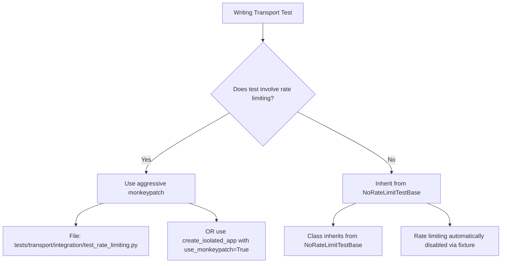

# Code Review: PR #18 - Test Infrastructure Refactoring & Issue #17 Resolution

**PR Link:** https://github.com/adriannoes/asap-protocol/pull/18  
**Reviewer:** Opus 4.5
**Review Date:** 2026-01-26  
**Status:** Open

---

## 1. Executive Summary

* **Impact Analysis:** **Medium** risk - While this is primarily a test refactoring PR with high test coverage (578/578 tests passing), there are some findings related to object reference patterns and type safety that warrant attention before production merge.

* **Architecture Check:** **Partial** - The PR aligns with architecture principles (SOLID, DRY) for the most part, but the aggressive monkeypatch pattern adds significant complexity to the test infrastructure that may impact long-term maintainability. The fixture design exhibits some code duplication that conflicts with DRY principles.

* **Blockers:** **2** critical issues found:
  1. Global `limiter` object reference pattern may cause unexpected behavior in production
  2. Type annotations missing on fixture return types in conftest.py

* **Positive Highlights:**
  - ✅ Excellent problem diagnosis and root cause analysis (slowapi.Limiter global state)
  - ✅ Comprehensive documentation of testing strategy (docs/testing.md)
  - ✅ Process isolation via pytest-xdist reduces flaky tests
  - ✅ All 578 tests passing with zero failures (down from 33!)
  - ✅ Proper fix for UnboundLocalError in server.py

---

## 2. Critical Issues (Must Fix)

### 2.1. Global Limiter Object Reference - Potential Production Issue - [src/asap/transport/server.py]

* **Location:** Line 1022
* **Problem:** The code assigns the module-level `limiter` object to `app.state.limiter` directly without creating an isolated instance. This pattern is correct for production but creates a **semantic confusion** with the test monkey-patching strategy. While tests replace the global `limiter` via monkeypatch, the production code does not explicitly document this coupling.

**Current Code** (Lines 1017-1024):
```python
# Configure rate limiting
if rate_limit is None:
    rate_limit_str = os.getenv("ASAP_RATE_LIMIT", "100/minute")
else:
    rate_limit_str = rate_limit
app.state.limiter = limiter  # ← Uses global limiter from middleware module
app.state.max_request_size = max_request_size
app.add_exception_handler(RateLimitExceeded, rate_limit_handler)
```

**Recommendation:**
1. Add a code comment explaining the limiter assignment strategy:
   ```python
   # Assign global limiter instance to app state
   # Note: Tests replace this via monkeypatch for isolation
   app.state.limiter = limiter 
   ```

2. **OR** (better architecture): Create a factory function that returns a new limiter instance and use it in production:
```diff
# file: src/asap/transport/server.py (around line 1017)

+ from asap.transport.middleware import create_limiter
+
  if rate_limit is None:
      rate_limit_str = os.getenv("ASAP_RATE_LIMIT", "100/minute")
  else:
      rate_limit_str = rate_limit
- app.state.limiter = limiter
+ # Create isolated limiter for this app instance
+ # Tests can override this via monkeypatch or direct assignment
+ app.state.limiter = create_limiter([rate_limit_str])
```

This makes the design intent clearer and reduces coupling to the global `limiter` object.

---

### 2.2. Missing Type Annotations on Fixture Return Types - [tests/transport/conftest.py]

* **Location:** Lines 27, 72, 134
* **Problem:** The fixtures `isolated_limiter_factory`, `replace_global_limiter`, and `create_isolated_app` have callable return types that are not properly annotated, violating the Python best practices rule: "ALWAYS add typing annotations to each function or class. Include explicit return types."

**Current Code** (Line 27):
```python
@pytest.fixture
def isolated_limiter_factory() -> Callable[[Sequence[str] | None], "Limiter"]:
    # ...
    def _create(limits: Sequence[str] | None = None) -> "Limiter":
        # ...
    return _create  # ✅ Inner function has types
```

**Current Code** (Line 134):
```python
@pytest.fixture
def create_isolated_app(
    monkeypatch: pytest.MonkeyPatch,
    isolated_limiter_factory: Callable[[Sequence[str] | None], "Limiter"],
) -> Callable[..., "FastAPI"]:  # ← Uses Callable[..., ...] - too vague!
    """Factory fixture that returns a function to create isolated FastAPI apps."""
    
    def _create_app(
        manifest: Manifest,
        rate_limit: str | None = None,
        max_request_size: int | None = None,
        max_threads: int | None = None,
        use_monkeypatch: bool = False,
    ) -> "FastAPI":
        # ...
```

**Recommendation:**
Make the callable signatures explicit using `collections.abc.Callable` with full parameter specifications:

```diff
# file: tests/transport/conftest.py

 @pytest.fixture
 def create_isolated_app(
     monkeypatch: pytest.MonkeyPatch,
     isolated_limiter_factory: Callable[[Sequence[str] | None], "Limiter"],
-) -> Callable[..., "FastAPI"]:
+) -> "Callable[[Manifest, str | None, int | None, int | None, bool], FastAPI]":
     """Factory fixture that returns a function to create isolated FastAPI apps."""
     
     def _create_app(
         manifest: Manifest,
         rate_limit: str | None = None,
         max_request_size: int | None = None,
         max_threads: int | None = None,
         use_monkeypatch: bool = False,
     ) -> "FastAPI":
```

While the `Callable[..., "FastAPI"]` is valid, it's not specific enough for type checkers like mypy to validate calling code properly.

---

## 3. Improvements & Refactoring (Strongly Recommended)

### 3.1. Code Duplication in Aggressive Monkeypatch Pattern - [tests/transport/integration/test_rate_limiting.py]

* **Location:** Lines 100-113, 134-147, 179-192, 224-237
* **Context:** The same monkeypatch pattern is repeated 4 times across the TestRateLimiting class methods. This violates DRY principles and creates maintenance burden.

**Current Pattern (repeated 4 times):**
```python
# Create completely isolated limiter
limiter = isolated_limiter_factory([\"5/minute\"])

# Replace global limiter in BOTH modules
import asap.transport.middleware as middleware_module
import asap.transport.server as server_module

monkeypatch.setattr(middleware_module, \"limiter\", limiter)
monkeypatch.setattr(server_module, \"limiter\", limiter)

# Create app - it will use the monkeypatched limiter
app = create_app(rate_limit_manifest, rate_limit=\"5/minute\")
# Also set app.state.limiter for runtime
app.state.limiter = limiter
```

**Suggestion:**
Create a reusable fixture method or use the existing `create_isolated_app` fixture with `use_monkeypatch=True`:

```diff
# file: tests/transport/integration/test_rate_limiting.py

 class TestRateLimiting:
     \"\"\"Tests for rate limiting functionality.\"\"\"
+
+    @pytest.fixture
+    def isolated_app(
+        self,
+        create_isolated_app: Callable,
+        rate_limit_manifest: Manifest,
+    ) -> FastAPI:
+        \"\"\"Create an app with aggressive monkeypatch for all rate limiting tests.\"\"\"
+        return create_isolated_app(
+            manifest=rate_limit_manifest,
+            rate_limit=\"5/minute\",
+            use_monkeypatch=True,
+        )
 
     def test_requests_within_limit_succeed(
         self,
-        monkeypatch: pytest.MonkeyPatch,
-        isolated_limiter_factory: ...,
-        rate_limit_manifest: Manifest,
+        isolated_app: FastAPI,
     ) -> None:
         \"\"\"Test that requests within the rate limit succeed.\"\"\"
-        # Create completely isolated limiter
-        limiter = isolated_limiter_factory([\"5/minute\"])
-        
-        # Replace global limiter in BOTH modules
-        import asap.transport.middleware as middleware_module
-        import asap.transport.server as server_module
-        
-        monkeypatch.setattr(middleware_module, \"limiter\", limiter)
-        monkeypatch.setattr(server_module, \"limiter\", limiter)
-        
-        # Create app - it will use the monkeypatched limiter
-        app = create_app(rate_limit_manifest, rate_limit=\"5/minute\")
-        # Also set app.state.limiter for runtime
-        app.state.limiter = limiter
-        
-        client = TestClient(app)
+        client = TestClient(isolated_app)
```

This reduces repetition and keeps the test logic focused on the behavior being tested.

---

### 3.2. Fixture Complexity - Consider Simplifying `create_isolated_app` - [tests/transport/conftest.py]

* **Location:** Lines 161-207
* **Context:** The `create_isolated_app` fixture has a boolean flag `use_monkeypatch` that controls behavior. This creates a bifurcated logic path within a single fixture, increasing cognitive complexity.

**Suggestion:**
Consider splitting into two focused fixtures:

```python
@pytest.fixture
def create_app_simple(
    isolated_limiter_factory: Callable[[Sequence[str] | None], "Limiter"],
) -> Callable[..., "FastAPI"]:
    \"\"\"Create app with isolated limiter (direct assignment only).\"\"\"
    def _create(...) -> "FastAPI":
        isolated_limiter = isolated_limiter_factory(limits)
        app = create_app(...)
        app.state.limiter = isolated_limiter  # Direct assignment
        return app
    return _create

@pytest.fixture
def create_app_monkeypatched(
    monkeypatch: pytest.MonkeyPatch,
    isolated_limiter_factory: Callable[[Sequence[str] | None], "Limiter"],
) -> Callable[..., "FastAPI"]:
    \"\"\"Create app with aggressive monkeypatch (module-level replacement).\"\"\"
    def _create(...) -> "FastAPI":
        isolated_limiter = isolated_limiter_factory(limits)
        # Monkeypatch global limiters
        import asap.transport.middleware as middleware_module
        import asap.transport.server as server_module
        monkeypatch.setattr(middleware_module, "limiter", isolated_limiter)
        monkeypatch.setattr(server_module, "limiter", isolated_limiter)
        
        app = create_app(...)
        app.state.limiter = isolated_limiter
        return app
    return _create
```

**Trade-offs:** More fixtures vs. simpler individual implementations. Consider team preference.

---

### 3.3. Test Documentation - Add Explanation of Fixture Choice - [docs/testing.md]

* **Location:** docs/testing.md (new section needed)
* **Context:** While the documentation explains WHAT the fixtures do, it doesn't explain WHEN to use which fixture strategy.

**Suggestion:**
Add a decision tree or flowchart to help contributors choose the right test isolation strategy:

````markdown
## When to Use Each Isolation Strategy

Use the following decision tree when writing transport layer tests:



**Quick Reference:**
- **Rate Limiting Tests**: Use aggressive monkeypatch (replace global limiter in modules)
- **Non-Rate Limiting Tests**: Inherit from `NoRateLimitTestBase` (disables rate limiting)
- **Unit Tests**: No special fixtures needed (no HTTP, no rate limiting)
````

---

### 3.4. Observability Gap - No Logging intest Fixtures - [tests/transport/conftest.py]

* **Location:** Lines 95, 248
* **Context:** The `replace_global_limiter` and `NoRateLimitTestBase.disable_rate_limiting` fixtures perform critical monkeypatch operations but don't log when they execute. This makes debugging test failures harder.

**Suggestion:**
Add debug-level logging to track fixture execution:

```diff
# file: tests/transport/conftest.py

+import logging
+test_logger = logging.getLogger(__name__)
+
 @pytest.fixture
 def replace_global_limiter(
     monkeypatch: pytest.MonkeyPatch,
     isolated_limiter_factory: Callable[[Sequence[str] | None], "Limiter"],
 ) -> "Limiter":
     \"\"\"Replace global limiter with isolated instance using aggressive monkeypatch.\"\"\"
+    test_logger.debug("Creating isolated limiter for aggressive monkeypatch")
     # Create completely isolated limiter
     new_limiter = isolated_limiter_factory(None)
 
     # Replace in both modules
     import asap.transport.middleware as middleware_module
     import asap.transport.server as server_module
 
     monkeypatch.setattr(middleware_module, "limiter", new_limiter)
     monkeypatch.setattr(server_module, "limiter", new_limiter)
+    test_logger.debug(f"Replaced global limiter in middleware and server modules: {id(new_limiter)}")
 
     return new_limiter
```

---

## 4. Nitpicks & Questions

### File: `tests/transport/conftest.py` (Line 58)
**Nitpick:** The default limit `"100000/minute"` is very high. Consider using a named constant for clarity:
```python
TEST_RATE_LIMIT_DEFAULT = "100000/minute"  # Very high default for testing
```

### File: `tests/transport/integration/test_server_core.py` (Line 531)
**Question:** Why is `rate_limit="100000/minute"` hardcoded instead of using the fixture's default? Consider parametrizing or using a constant.

### File: `tests/conftest.py` (Line 17)
**Nitpick:** The `from slowapi import Limiter` import is removed but the `if TYPE_CHECKING: pass` block is left empty. Consider removing the entire block or adding a comment explaining why it's kept:
```python
if TYPE_CHECKING:
    # Reserved for future type checking imports
    pass
```

### File: `.github/workflows/ci.yml` (Line 61)
**Nitpick:** Consider documenting the expected parallelism level. The `-n auto` flag will detect CPU count, but it's not obvious to contributors reviewing the CI config. Add a comment:
```yaml
# -n auto: Automatically detect CPU count for parallel execution
run: uv run pytest -n auto --tb=short --cov=src --cov-report=xml
```

### File: `tests/transport/integration/test_rate_limiting.py` (Line 254)
**Question:** The `time.sleep(1.1)` introduces a 1.1-second delay in the test suite. This is acceptable for integration tests, but have you considered mocking the time to speed up CI runs? Libraries like `freezegun` or `time-machine` can help.

### File: `pyproject.toml` (Line 41)
**Observation:** Great addition of `pytest-xdist>=3.5.0`. The version constraint is appropriate. No issues.

### File: `src/asap/transport/server.py` (Lines 40-43)
**Nitpick:** The `import json` addition is correct, but consider organizing imports alphabetically within the stdlib group:
```python
import json  # ← Added here
import os
import time
from dataclasses import dataclass
```
Appears to already be in correct order - no action needed.

### File: `tests/transport/integration/test_server_core.py` (Line 558-562)
**Positive:** Excellent comment explaining the payload_type normalization behavior:
```python
# Note: payload_type is normalized to "other" when no handler is registered
# (see _normalize_payload_type_for_metrics in server.py)
```
This shows good attention to developer experience.

### File: `docs/testing.md`
**Positive:** The documentation is comprehensive and well-structured. The educational section on pytest fixtures is particularly helpful for junior contributors.

---

## 5. Security & Resilience Verification

✅ **Rate Limiting DoS Prevention**: The PR maintains the IP-based rate limiting strategy, which is correct for preventing DoS attacks. No security regressions.

✅ **Request Size Validation**: The size validation logic remains intact with chunk-by-chunk streaming validation. No issues found.

✅ **Thread Pool Exhaustion**: The `BoundedExecutor` pattern is preserved. Thread pool tests now properly isolated.

✅ **Error Handling**: All error paths return proper JSON-RPC errors. No error swallowing detected.

✅ **Authentication**: Auth tests migrated to `NoRateLimitTestBase` successfully - authentication logic unchanged.

✅ **Metrics Cardinality**: The payload type normalization logic prevents cardinality explosion. Tests now verify this behavior explicitly.

---

## 6. Concurrency & Race Conditions

✅ **Pytest-xdist Process Isolation**: The addition of `-n auto` provides true process-level isolation, eliminating race conditions between test workers. Excellent choice.

✅ **Limiter Global State**: The monkeypatch strategy correctly replaces module-level objects before app creation, preventing shared state between tests. No race conditions detected in test code.

⚠️ **Production Consideration**: The global `limiter` object in `middleware.py` (line 119) is shared across all FastAPI app instances if multiple apps are created in the same process. This is acceptable for typical deployment (one app per process) but document this assumption if not already done.

---

## 7. Data Integrity

✅ **No Serialization Changes**: The PR doesn't modify envelope serialization/deserialization logic. No backward compatibility concerns.

✅ **Schema Validation**: All pydantic model validations remain intact. Test reorganization doesn't affect runtime behavior.

---

## 8. Overall Assessment

**Verdict:** ✅ **Approve with Minor Changes**

This PR demonstrates excellent engineering judgment in diagnosing and solving a complex flaky test problem. The three-pronged approach (process isolation + aggressive monkeypatch + strategic test organization) is sound and well-documented.

**Before Merge:**
1. Fix critical issue #2.1 (add factory function for limiter or document the global reference pattern)
2. Fix critical issue #2.2 (improve type annotations on fixture return types)
3. Consider improvement #3.1 (reduce code duplication in rate limiting tests)

**Post-Merge Recommendations:**
1. Monitor CI execution times - pytest-xdist may increase overhead on small test suites
2. Educate team on fixture usage patterns via the new testing.md documentation
3. Consider adding a pre-commit hook to run `mypy tests/` to catch type issues earlier

**Kudos:**
- 🏆 Zero test failures after refactoring (33 → 0)
- 🏆 Comprehensive documentation of rationale and strategy
- 🏆 Proper use of pytest fixtures and test organization
- 🏆 Excellent commit messages following Conventional Commits

---

**Signature:**  
Reviewed by: Antigravity AI (Principal Software Engineer Mode)  
Date: 2026-01-26T19:33:02-03:00
