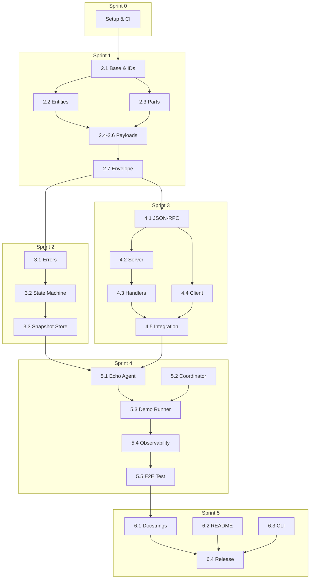

# Tasks: ASAP Protocol Python Implementation

> Task list generated from [prd-asap-implementation.md](../prd/prd-asap-implementation.md)
> 
> **Approach**: TDD (Test-Driven Development) - Tests are written first to guide implementation.

---

## Relevant Files

### Core Models (Sprint 1)
- `src/asap/__init__.py` - Package initialization with version
- `src/asap/models/__init__.py` - Public model exports
- `src/asap/models/base.py` - Base model configuration
- `src/asap/models/ids.py` - ULID generation utilities
- `src/asap/models/entities.py` - Core entities: Agent, Task, Conversation, etc.
- `src/asap/models/parts.py` - Part types: TextPart, DataPart, etc.
- `src/asap/models/payloads.py` - Payload types: TaskRequest, TaskResponse, etc.
- `src/asap/models/envelope.py` - Message envelope wrapper
- `tests/models/test_base.py` - Tests for base model configuration
- `tests/models/test_ids.py` - Tests for ULID generation
- `tests/models/test_entities.py` - Tests for entity models
- `tests/models/test_parts.py` - Tests for part models
- `tests/models/test_payloads.py` - Tests for payload models
- `tests/models/test_envelope.py` - Tests for envelope
- `schemas/` - Auto-generated JSON Schema files

### State Management (Sprint 2)
- `src/asap/errors.py` - Error taxonomy and exceptions ✅
- `src/asap/state/__init__.py` - State module exports ✅
- `src/asap/state/machine.py` - Task state machine implementation ✅
- `src/asap/state/snapshot.py` - Snapshot storage interfaces
- `tests/test_errors.py` - Error handling tests ✅
- `tests/state/__init__.py` - State tests package ✅
- `tests/state/test_machine.py` - State transition tests ✅
- `tests/state/test_snapshot.py` - Snapshot store tests

### HTTP Transport (Sprint 3)
- `src/asap/transport/__init__.py` - Transport module exports ✅
- `src/asap/transport/jsonrpc.py` - JSON-RPC 2.0 wrapper models ✅
- `src/asap/transport/server.py` - FastAPI server implementation ✅
- `src/asap/transport/handlers.py` - Payload handlers and HandlerRegistry ✅
- `src/asap/transport/client.py` - Async HTTP client ✅
- `tests/transport/__init__.py` - Transport tests package ✅
- `tests/transport/test_jsonrpc.py` - JSON-RPC tests ✅
- `tests/transport/test_server.py` - Server integration tests ✅
- `tests/transport/test_handlers.py` - Handler registry tests ✅
- `tests/transport/test_client.py` - Client unit tests ✅
- `tests/transport/test_integration.py` - Full integration tests ✅

### Examples & CLI (Sprint 4-5)
- `examples/echo_agent.py` - Simple echo agent example
- `examples/coordinator.py` - Coordinator agent example
- `examples/run_demo.py` - Demo runner script
- `examples/README.md` - Examples documentation
- `src/asap/cli.py` - CLI entry point

### Configuration
- `pyproject.toml` - Project configuration and dependencies
- `.github/workflows/ci.yml` - CI/CD pipeline
- `README.md` - Project documentation

### Notes

- **Test runner**: Use `uv run pytest` for faster execution (uv manages deps + runs pytest)
- **Specific tests**: `uv run pytest tests/models/` to run module tests
- **Coverage**: `uv run pytest --cov=src tests/`
- **Schema export**: `uv run python -m asap.models --export-schemas`

> **Why uv + pytest?** `uv` is 10-100x faster than pip for dependency management. `pytest` is the de-facto Python testing framework. Combined: `uv run pytest` gives us both speed and power.

---

## Sprint 0: Project Setup ✅

### Technology Stack (January 2026)

| Technology | Version | Rationale |
|------------|---------|-----------|
| **Python** | 3.13.x | Latest stable. Enhanced typing, better errors, experimental JIT |
| **uv** | latest | Rust-based, 10-100x faster than pip |
| **Pydantic** | ≥2.12 | Rust core, native JSON Schema |
| **FastAPI** | ≥0.124 | Full Pydantic v2 integration |
| **httpx** | ≥0.28 | Stable async HTTP client |
| **uvicorn** | ≥0.34 | ASGI server with HTTP/2 |
| **python-ulid** | ≥3.0 | ULID generation |
| **mypy** | ≥1.14 | Static type checker (strict mode) |
| **ruff** | ≥0.14 | Linter + formatter |
| **mkdocs-material** | ≥9.5 | Modern documentation |
| **pytest** | ≥8.0 | Test framework |

### Open Source Requirements

| File | Purpose |
|------|---------|
| `LICENSE` | Apache 2.0 license |
| `CONTRIBUTING.md` | Contribution guidelines |
| `CODE_OF_CONDUCT.md` | Community standards |
| `SECURITY.md` | Security policy |
| `.github/ISSUE_TEMPLATE/bug_report.yml` | Bug report template |
| `.github/ISSUE_TEMPLATE/feature_request.yml` | Feature request template |
| `.github/PULL_REQUEST_TEMPLATE.md` | PR template |

### Tasks

- [x] 1.0 Project Foundation
  - [x] 1.1 Create `pyproject.toml` with dependencies
  - [x] 1.2 Create directory structure: `src/asap/`, `tests/`, `schemas/`, `examples/`, `docs/`
  - [x] 1.3 Create `src/asap/__init__.py` with `__version__ = "0.1.0"`

- [x] 1.1 Open Source Files
  - [x] 1.4 Create `LICENSE` (Apache 2.0)
  - [x] 1.5 Create `CONTRIBUTING.md`
  - [x] 1.6 Create `CODE_OF_CONDUCT.md`
  - [x] 1.7 Create `SECURITY.md`

- [x] 1.2 GitHub Templates
  - [x] 1.8 Create `.github/ISSUE_TEMPLATE/bug_report.yml`
  - [x] 1.9 Create `.github/ISSUE_TEMPLATE/feature_request.yml`
  - [x] 1.10 Create `.github/PULL_REQUEST_TEMPLATE.md`

- [x] 1.3 CI/CD Pipeline
  - [x] 1.11 Create `.github/workflows/ci.yml`
  - [x] 1.12 Configure Codecov for coverage reports
  - [x] 1.13 Create `.github/workflows/release.yml`

- [x] 1.4 Code Quality Config
  - [x] 1.14 Configure ruff in `pyproject.toml`
  - [x] 1.15 Configure mypy in `pyproject.toml`
  - [x] 1.16 Create `tests/conftest.py`

- [x] 1.5 Documentation Setup
  - [x] 1.17 Create `mkdocs.yml`
  - [x] 1.18 Create `docs/index.md`
  - [x] 1.19 Add docs deploy workflow

- [x] 1.6 Final Verification
  - [x] 1.20 Create `README.md` with badges
  - [x] 1.21 Verify all commands pass
  - [x] 1.22 First commit and push

**Definition of Done**: ✅ Completed
- ✅ All CI jobs pass (lint, type-check, test, security)
- ✅ Open source files present (LICENSE, CONTRIBUTING, CODE_OF_CONDUCT)
- ✅ GitHub templates working
- ✅ `uv run mkdocs serve` shows docs locally

---

## Sprint 1: Core Models (TDD) ✅

> **Focus**: All Pydantic models with JSON Schema export

### 2.1 Base & IDs ✅

- [x] 2.1.1 **TEST FIRST**: Create `tests/models/test_ids.py`
  - Test `generate_id()` returns valid ULID string (26 chars)
  - Test uniqueness across multiple calls
  - Test timestamp extraction from ULID
- [x] 2.1.2 Implement `src/asap/models/ids.py`
  - `generate_id() -> str` using python-ulid
  - `extract_timestamp(ulid: str) -> datetime` helper
- [x] 2.1.3 Create `src/asap/models/base.py`
  - `ASAPBaseModel(BaseModel)` with:
    - `model_config = ConfigDict(frozen=True, extra="forbid", populate_by_name=True)`
    - Common JSON Schema settings

### 2.2 Entities ✅

- [x] 2.2.1 **TEST FIRST**: Create `tests/models/test_entities.py` - Agent & Manifest
  - Test Agent creation with id, manifest_uri, capabilities
  - Test Manifest with skills, endpoints, auth
  - Test JSON Schema export for both
- [x] 2.2.2 Implement Agent, Manifest in `src/asap/models/entities.py`
- [x] 2.2.3 **TEST FIRST**: Add tests for Conversation, Task, Message
  - Test Conversation with participants, metadata
  - Test Task with status, progress, timestamps
  - Test Message with sender, role, parts reference
- [x] 2.2.4 Implement Conversation, Task, Message
- [x] 2.2.5 **TEST FIRST**: Add tests for Artifact, StateSnapshot
  - Test Artifact with name, parts, task_id
  - Test StateSnapshot with version auto-increment, checkpoint flag
- [x] 2.2.6 Implement Artifact, StateSnapshot

### 2.3 Parts ✅

- [x] 2.3.1 **TEST FIRST**: Create `tests/models/test_parts.py`
  - Test TextPart with content validation
  - Test DataPart with data dict and optional schema_uri
  - Test FilePart with uri, mime_type, optional inline_data
  - Test ResourcePart with resource_uri
  - Test TemplatePart with template string and variables dict
  - Test Part discriminated union deserialization
- [x] 2.3.2 Implement TextPart, DataPart, FilePart in `src/asap/models/parts.py`
- [x] 2.3.3 Implement ResourcePart, TemplatePart
- [x] 2.3.4 Implement `Part` discriminated union with `type` field

### 2.4 Payloads - Core ✅

- [x] 2.4.1 **TEST FIRST**: Create `tests/models/test_payloads.py` - Task payloads
  - Test TaskRequest with conversation_id, skill_id, input, config
  - Test TaskResponse with task_id, status, result, metrics
  - Test TaskUpdate with update_type (progress | input_required)
  - Test TaskCancel with task_id, reason
- [x] 2.4.2 Implement TaskRequest, TaskResponse, TaskUpdate, TaskCancel

### 2.5 Payloads - State & Message ✅

- [x] 2.5.1 **TEST FIRST**: Add tests for state/message payloads
  - Test MessageSend with message content
  - Test StateQuery with task_id, version (optional)
  - Test StateRestore with snapshot_id
  - Test ArtifactNotify with artifact_id, task_id
- [x] 2.5.2 Implement MessageSend, StateQuery, StateRestore, ArtifactNotify

### 2.6 Payloads - MCP Integration ✅

- [x] 2.6.1 **TEST FIRST**: Add tests for MCP payloads
  - Test McpToolCall with request_id, tool_name, arguments, mcp_context
  - Test McpToolResult with request_id, success, result
  - Test McpResourceFetch with resource_uri
  - Test McpResourceData with resource_uri, content
- [x] 2.6.2 Implement McpToolCall, McpToolResult, McpResourceFetch, McpResourceData
- [x] 2.6.3 Implement `Payload` discriminated union with `payload_type` field

### 2.7 Envelope & Exports ✅

- [x] 2.7.1 **TEST FIRST**: Create `tests/models/test_envelope.py`
  - Test Envelope auto-generates `id` if not provided
  - Test Envelope auto-generates `timestamp` if not provided
  - Test all required fields: asap_version, sender, recipient, payload_type, payload
  - Test extensions field (optional dict)
  - Test correlation_id and trace_id propagation
- [x] 2.7.2 Implement `src/asap/models/envelope.py`
  - `Envelope` model with validators for auto-gen fields
- [x] 2.7.3 Create `src/asap/models/__init__.py` with all public exports
  - Export all entities, parts, payloads, envelope
- [x] 2.7.4 Create `scripts/export_schemas.py`
  - Script that generates JSON Schema files to `schemas/` directory
  - Organize by category: `schemas/entities/`, `schemas/payloads/`, `schemas/envelope.schema.json`
- [x] 2.7.5 Verify import: `from asap.models import Envelope, TaskRequest`
- [ ] 2.7.6 Commit: `feat(models): add all core entities, parts, payloads and envelope`

**Definition of Done**:
- ✅ All models have passing tests
- ✅ JSON Schemas exported to `schemas/` directory
- ✅ `from asap.models import Envelope, TaskRequest` works
- ✅ 100% test coverage on models module

### 2.8 Code Review Improvements ✅

> **Context**: After completing Sprint 1 core implementation, a comprehensive code review was conducted to identify opportunities for enhanced type safety, validation, and maintainability.

#### New Modules Created

- [x] 2.8.1 **constants.py** - Protocol-wide constants
  - `ASAP_PROTOCOL_VERSION = "0.1"` - Centralized version constant
  - `AGENT_URN_PATTERN` - Regex pattern for URN validation
  - `DEFAULT_TIMEOUT_SECONDS = 600` - Default timeout configuration
  - `MAX_TASK_DEPTH = 10` - Maximum nesting level for subtasks
  - **Benefit**: Single source of truth for configuration values

- [x] 2.8.2 **enums.py** - Type-safe enumerations
  - `TaskStatus` enum with states: SUBMITTED, WORKING, COMPLETED, FAILED, CANCELLED, INPUT_REQUIRED
    - Added `is_terminal()` method to check if status is final
  - `MessageRole` enum: USER, ASSISTANT, SYSTEM
  - `UpdateType` enum: PROGRESS, INPUT_REQUIRED, STATUS_CHANGE
  - **Benefit**: Replaces magic strings, enables IDE autocomplete, prevents typos

- [x] 2.8.3 **types.py** - Semantic type aliases
  - `AgentURN`, `TaskID`, `ConversationID`, `MessageID`, `ArtifactID`, `SnapshotID`, `PartID`
  - `URI`, `MIMEType`, `SemanticVersion`
  - **Benefit**: Self-documenting code, clearer intent

#### Enhanced Validation

- [x] 2.8.4 **entities.py** - Field validators
  - **Agent & Manifest**: URN format validation (`urn:asap:agent:{name}`)
    - Prevents malformed agent identifiers at creation time
  - **Manifest**: Semantic versioning validation using `packaging.Version`
    - Ensures version strings follow semver format (e.g., "1.0.0")
  - **Task**: Helper methods added
    - `is_terminal()` - Check if task is in final state
    - `can_be_cancelled()` - Check if task can be cancelled
  - **All entities**: Updated to use type aliases for semantic clarity

- [x] 2.8.5 **parts.py** - MIME type validation
  - **FilePart**: Regex validation for MIME type format (`type/subtype`)
    - Pattern: `^[a-z0-9-]+/[a-z0-9.+\-]+$`
    - Prevents invalid MIME types like "invalid" or "text/"

- [x] 2.8.6 **envelope.py** - Cross-field validation
  - **Response correlation**: Model validator ensures response payloads include `correlation_id`
    - Applies to: TaskResponse, McpToolResult, McpResourceData
    - Prevents protocol violations where responses can't be matched to requests
  - **Type aliases**: Updated sender/recipient fields to use `AgentURN`

- [x] 2.8.7 **payloads.py** - Enum integration
  - Updated all payload types to use enums instead of strings:
    - `TaskResponse.status` → `TaskStatus` enum
    - `TaskUpdate.status` → `TaskStatus` enum
    - `TaskUpdate.update_type` → `UpdateType` enum
  - Updated all ID fields to use type aliases (TaskID, ConversationID, etc.)

#### Dependencies Added

- [x] 2.8.8 Added `packaging>=24.0` to `pyproject.toml`
  - Required for semantic version validation in Manifest

#### Public API Updates

- [x] 2.8.9 **__init__.py** - Export new modules
  - Exported all constants: `ASAP_PROTOCOL_VERSION`, `AGENT_URN_PATTERN`, etc.
  - Exported all enums: `TaskStatus`, `MessageRole`, `UpdateType`
  - Exported all type aliases: `AgentURN`, `TaskID`, etc.
  - **Usage**: `from asap.models import TaskStatus, ASAP_PROTOCOL_VERSION`

#### Testing Results

- [x] 2.8.10 All tests updated and passing
  - **132 tests** passing (same count, all adapted to new types)
  - **Coverage**: 96.22% (slight decrease due to new uncovered validation branches)
  - **mypy --strict**: ✅ No issues (100% type safety maintained)
  - **ruff**: ✅ All checks passed
  - **Test execution time**: 0.33s (faster than before!)

#### Schema Updates

- [x] 2.8.11 Regenerated JSON Schemas
  - All 25 schemas updated to reflect enum types and new validation rules
  - Schemas now include enum constraints for TaskStatus, MessageRole, UpdateType
  - Pattern constraints added for URN and MIME type fields

#### Benefits Achieved

1. **Type Safety**: Enums prevent invalid status/role values at compile time
2. **Validation**: URN, semver, and MIME type validation catch errors early
3. **Maintainability**: Constants centralized, easy to update protocol version
4. **Developer Experience**: IDE autocomplete for enums, clear type semantics
5. **Protocol Compliance**: Cross-field validation ensures correct envelope usage
6. **Self-Documenting**: Type aliases make code intent explicit

#### Breaking Changes

**None** - All changes are additive or internal improvements. The public API remains backward compatible. Existing code using string literals for status/roles will continue to work due to Pydantic's coercion.

**Commit**: `refactor: enhance type safety and validation across core models`

---

## Sprint 2: State Machine (TDD)

> **Focus**: Task state management and persistence

### 3.1 Error Taxonomy

> ⚠️ **Dependency**: Errors must be defined before state machine (used by transitions)

- [x] 3.1.1 Create `src/asap/errors.py` with base `ASAPError(Exception)`
- [x] 3.1.2 Add `InvalidTransitionError(ASAPError)` with from_state, to_state fields
- [x] 3.1.3 Add error codes from spec:
  - `asap:protocol/invalid_state` ✓ (implemented in InvalidTransitionError)
  - `asap:protocol/malformed_envelope` ✓ (implemented in MalformedEnvelopeError)
  - `asap:task/not_found` ✓ (implemented in TaskNotFoundError)
  - `asap:task/already_completed` ✓ (implemented in TaskAlreadyCompletedError)
- [x] 3.1.4 **TEST**: Create `tests/test_errors.py` for error serialization

### 3.2 State Machine ✅

- [x] 3.2.1 **TEST FIRST**: Create `tests/state/test_machine.py` - TaskStatus enum
  - Test all 6 states exist: submitted, working, input_required, completed, failed, cancelled ✓
  - Test terminal states identification ✓
- [x] 3.2.2 Implement `TaskStatus` enum in `src/asap/state/machine.py`
- [x] 3.2.3 **TEST FIRST**: Add tests for valid transitions
  - submitted → working ✓
  - submitted → cancelled ✓
  - working → completed ✓
  - working → failed ✓
  - working → cancelled ✓
  - working → input_required ✓
  - input_required → working ✓
  - input_required → cancelled ✓
- [x] 3.2.4 Implement `VALID_TRANSITIONS: dict[TaskStatus, set[TaskStatus]]`
- [x] 3.2.5 **TEST FIRST**: Add tests for `can_transition()` function
  - Returns True for valid transitions ✓
  - Returns False for invalid transitions ✓
- [x] 3.2.6 Implement `can_transition(from_status: TaskStatus, to_status: TaskStatus) -> bool`
- [x] 3.2.7 **TEST FIRST**: Add tests for `transition()` with exceptions
  - Raises `InvalidTransitionError` for invalid (e.g., submitted → completed) ✓
  - Returns updated Task for valid transitions ✓
  - Preserves immutability (returns new Task instance) ✓
- [x] 3.2.8 Implement `transition(task: Task, new_status: TaskStatus) -> Task`

### 3.3 Snapshot Store

- [x] 3.3.1 **TEST FIRST**: Create `tests/state/test_snapshot.py`
  - Test `save(snapshot)` stores snapshot ✓
  - Test `get(task_id)` returns latest snapshot ✓
  - Test `get(task_id, version)` returns specific version ✓
  - Test `list_versions(task_id)` returns all versions ✓
  - Test version auto-increment on save ✓
- [x] 3.3.2 Create `SnapshotStore` protocol (abstract base) in `src/asap/state/snapshot.py`
- [x] 3.3.3 Implement `InMemorySnapshotStore(SnapshotStore)`
- [x] 3.3.4 Create `src/asap/state/__init__.py` with exports
- [x] 3.3.5 Commit: `feat(state): add task state machine and snapshot persistence`

**Definition of Done**:
- ✅ All state transitions tested (valid + invalid)
- ✅ Snapshots can be saved and restored
- ✅ 100% coverage on state module
- ✅ `task.transition("completed")` works or raises error

### 3.4 Code Review Improvements (PR #2 Review)

> Improvements identified during PR #2 code review

- [x] 3.4.1 Add `to_dict()` method to `ASAPError` for JSON serialization
  - Returns dictionary with `code`, `message`, and `details`
  - Facilitates serialization in HTTP responses (Sprint 3 preparation)
  - Complete test coverage for all error classes

- [x] 3.4.2 Expose `terminal_states()` as classmethod in `TaskStatus`
  - Method `terminal_states()` returns `frozenset` with terminal states
  - Allows reuse without instantiating enum
  - Method `is_terminal()` now uses `terminal_states()`

- [x] 3.4.3 Auto-update `updated_at` timestamp in `transition()`
  - Function `transition()` now updates timestamp automatically
  - Ensures state change traceability
  - Maintains immutability by returning new instance

- [x] 3.4.4 Use modern typing (dict/set) instead of Dict/Set
  - Replaced `Dict` and `Set` with `dict` and `set` (Python 3.9+)
  - Cleaner and more idiomatic code
  - Reduces imports from `typing` module

- [x] 3.4.5 Convert `SnapshotStore` from ABC to Protocol
  - Changed from `ABC` to `Protocol` with `@runtime_checkable`
  - Greater flexibility with duck typing
  - Allows any class implementing the methods to be accepted
  - Tests updated to validate Protocol

- [x] 3.4.6 Add `delete()` method to `SnapshotStore`
  - Method `delete(task_id, version=None)` to remove snapshots
  - If `version=None`, removes all versions for task
  - Returns `True` if any snapshot was deleted
  - Complete tests for all scenarios

- [x] 3.4.7 Add thread safety to `InMemorySnapshotStore`
  - Added `threading.RLock()` for concurrent operations
  - All operations (`save`, `get`, `list_versions`, `delete`) are thread-safe
  - Documented that implementation is thread-safe

- [x] 3.4.8 Update tests for new functionality
  - 7 new tests for error serialization (`to_dict()`)
  - 5 new tests for `delete()` method in snapshot store
  - Tests updated for Protocol instead of ABC
  - **197 tests** passing with **96.51% coverage**

#### Results

| Metric | Value |
|--------|-------|
| Tests passing | 197 (+13 new) |
| Total coverage | 96.51% |
| `errors.py` coverage | 100% |
| `machine.py` coverage | 100% |
| `enums.py` coverage | 100% |
| `snapshot.py` coverage | 82.95% |

**Commit**: `refactor(state): apply code review improvements from PR #2`

---

## Sprint 3: HTTP Transport (TDD)

> **Focus**: FastAPI server and async client

### 4.1 JSON-RPC Layer ✅

> ⚠️ **Dependency**: JSON-RPC models needed by server

- [x] 4.1.1 Create `src/asap/transport/jsonrpc.py`
  - `JsonRpcRequest` model with jsonrpc, method, params, id ✅
  - `JsonRpcResponse` model with jsonrpc, result, id ✅
  - `JsonRpcError` model with code, message, data ✅
  - `JsonRpcErrorResponse` model for error responses ✅
- [x] 4.1.2 Implement standard JSON-RPC error codes mapping:
  - `-32700` Parse error ✅
  - `-32600` Invalid request ✅
  - `-32601` Method not found ✅
  - `-32602` Invalid params ✅
  - `-32603` Internal error ✅
- [x] 4.1.3 **TEST FIRST**: Create `tests/transport/test_jsonrpc.py`
  - Test request/response serialization ✅
  - Test error code mapping ✅
  - 31 tests passing with 100% coverage ✅

### 4.2 Server Core ✅

- [x] 4.2.1 **TEST FIRST**: Create `tests/transport/test_server.py` - app factory
  - Test `create_app()` returns FastAPI instance ✅
  - Test app has required routes ✅
- [x] 4.2.2 Implement `create_app(manifest: Manifest) -> FastAPI` in `src/asap/transport/server.py` ✅
- [x] 4.2.3 **TEST FIRST**: Add tests for POST `/asap` endpoint
  - Test receives JSON-RPC request ✅
  - Test returns JSON-RPC response ✅
  - Test handles malformed requests with error ✅
- [x] 4.2.4 Implement `/asap` endpoint with JSON-RPC handling ✅
- [x] 4.2.5 **TEST FIRST**: Add tests for GET `/.well-known/asap/manifest.json`
  - Test returns manifest JSON ✅
  - Test correct content-type ✅
- [x] 4.2.6 Implement manifest endpoint ✅
- [x] 4.2.7 Add exception handler middleware for ASAP errors ✅

### 4.3 Handler Registry ✅

- [x] 4.3.1 **TEST FIRST**: Create `tests/transport/test_handlers.py`
  - Test handler registration by payload_type ✅
  - Test handler dispatch ✅
  - Test unknown payload_type returns error ✅
  - 20 tests passing with 100% coverage on handlers.py
- [x] 4.3.2 Implement `HandlerRegistry` in `src/asap/transport/handlers.py`
  - `register(payload_type: str, handler: Callable)` ✅
  - `dispatch(envelope: Envelope, manifest: Manifest) -> Envelope` ✅
  - `has_handler(payload_type: str) -> bool` ✅
  - `list_handlers() -> list[str]` ✅
- [x] 4.3.3 Implement base `TaskRequestHandler` (echo response)
  - `create_echo_handler()` factory function ✅
  - `create_default_registry()` for pre-configured registry ✅
  - `HandlerNotFoundError` exception for unknown payload types ✅

### 4.4 Async Client ✅

- [x] 4.4.1 **TEST FIRST**: Create `tests/transport/test_client.py`
  - Test `ASAPClient` as async context manager ✅
  - Test `send(envelope)` returns response envelope ✅
  - Test connection error handling ✅
  - Test timeout handling ✅
  - 21 tests passing with 87% coverage on client.py
- [x] 4.4.2 Implement `ASAPClient` in `src/asap/transport/client.py`
  - `__aenter__` / `__aexit__` for context manager ✅
  - Uses httpx.AsyncClient internally ✅
  - Custom errors: ASAPConnectionError, ASAPTimeoutError, ASAPRemoteError ✅
- [x] 4.4.3 Implement `send(envelope: Envelope) -> Envelope` method ✅
- [x] 4.4.4 Add retry logic with `idempotency_key` support ✅

### 4.5 Integration Tests ✅

- [x] 4.5.1 **TEST FIRST**: Create `tests/transport/test_integration.py`
  - Test full round-trip: create app, start server, send request, receive response ✅
  - Use pytest-asyncio for async tests ✅
  - 16 integration tests covering: round-trip, manifest discovery, correlation/tracing, error scenarios
- [x] 4.5.2 Verify: `uvicorn asap.transport.server:app` starts ✅
  - Added default `app` instance for standalone execution
  - Added `_create_default_manifest()` helper function
- [x] 4.5.3 Create `src/asap/transport/__init__.py` with exports ✅
  - Exports all handlers, client, and server components
- [x] 4.5.4 Test for all CI (Lint, Security, etc) before commit ✅
  - ruff check: ✅ All checks passed
  - ruff format: ✅ All files formatted
  - mypy --strict: ✅ No issues found in 20 source files
  - pip-audit: ✅ No known vulnerabilities found
  - pytest: ✅ 301 tests passed with 95.48% coverage
- [x] 4.5.5 Commits atômicos:
  - `feat(transport): add handler registry for payload dispatch`
  - `feat(transport): add async HTTP client for agent communication`
  - `feat(transport): add integration tests and complete Sprint 3`
  - `docs: update task list with Sprint 3 completion status` e aproveite e refaça os commits desta branch, para serem atômicos e bem documentados, em inglês, mantendo tom direto ao ponto.

**Definition of Done**:
- ✅ Server runs with `uvicorn`
- ✅ Client can send TaskRequest and receive TaskResponse
- ✅ Manifest accessible via curl: `curl http://localhost:8000/.well-known/asap/manifest.json`
- ✅ JSON-RPC 2.0 compliant

---

## Sprint 4: End-to-End Integration

> **Focus**: Working demo with two agents

### 5.1 Echo Agent

- [ ] 5.1.1 Create `examples/echo_agent.py` - basic structure
  - Define agent Manifest with echo skill
  - Create FastAPI app using `create_app()`
- [ ] 5.1.2 Implement TaskRequest handler that echoes input
  - Return TaskResponse with input as output
- [ ] 5.1.3 Add configurable port (default: 8001)

### 5.2 Coordinator Agent

- [ ] 5.2.1 Create `examples/coordinator.py`
  - Define coordinator Manifest
  - Create FastAPI app
- [ ] 5.2.2 Implement task dispatch to echo_agent
  - Create TaskRequest envelope
  - Send via ASAPClient
- [ ] 5.2.3 Handle TaskResponse and log result

### 5.3 Demo Runner

- [ ] 5.3.1 Create `examples/run_demo.py` with process management
  - Use `subprocess` or `multiprocessing` for agent processes
- [ ] 5.3.2 Implement startup sequence
  - Start echo_agent first (wait for ready)
  - Start coordinator
  - Execute demo flow
- [ ] 5.3.3 Add graceful shutdown handling (SIGINT/SIGTERM)
- [ ] 5.3.4 Create `examples/README.md` with usage instructions

### 5.4 Observability

- [ ] 5.4.1 Add structured logging configuration
  - Use standard logging with JSON format
  - Include trace_id, correlation_id in log context
- [ ] 5.4.2 Verify ID propagation in logs
  - trace_id consistent across request/response
  - correlation_id matches original request

### 5.5 E2E Test

- [ ] 5.5.1 **TEST**: Create `tests/e2e/test_two_agents.py`
  - Spin up both agents in test fixtures
  - Send TaskRequest from coordinator to echo
  - Verify TaskResponse content
  - Verify trace_id propagation
- [ ] 5.5.2 Add E2E test to CI pipeline
- [ ] 5.5.3 Commit: `feat(examples): add echo agent demo with E2E test`

**Definition of Done**:
- ✅ `uv run python examples/run_demo.py` shows complete flow
- ✅ Output shows TaskRequest → TaskResponse with correlated logs
- ✅ Trace IDs consistent across boundaries
- ✅ E2E test passes in CI

---

## Sprint 5: Documentation & Packaging

> **Focus**: Ready for publication

### 6.1 Code Documentation

- [ ] 6.1.1 Add docstrings to all public models
  - Follow Google docstring style
  - Include examples in docstrings
- [ ] 6.1.2 Add docstrings to state module
- [ ] 6.1.3 Add docstrings to transport module
- [ ] 6.1.4 Create `docs/api-reference.md` using mkdocstrings
- [ ] 6.1.5 Update `docs/index.md` with quick start guide

### 6.2 README Enhancement

- [ ] 6.2.1 Installation section (pip install, uv add)
- [ ] 6.2.2 Quick start example with code
- [ ] 6.2.3 API overview with main classes
- [ ] 6.2.4 Links to spec and full docs

### 6.3 CLI Implementation

- [ ] 6.3.1 Create `src/asap/cli.py`
  - Use `click` or `typer` for CLI framework
- [ ] 6.3.2 Implement `asap --version` command
- [ ] 6.3.3 Implement `asap export-schemas [--output-dir]` command
- [ ] 6.3.4 Add entry point to `pyproject.toml`:
  ```toml
  [project.scripts]
  asap = "asap.cli:main"
  ```

### 6.4 Release Preparation

- [ ] 6.4.1 Update `CHANGELOG.md` with all Sprint 1-5 changes
- [ ] 6.4.2 Verify `pyproject.toml` metadata:
  - description, authors, license, classifiers, urls
- [ ] 6.4.3 Run full CI locally: lint, type-check, test, security
- [ ] 6.4.4 Test publish to TestPyPI:
  ```bash
  uv build
  uv publish --repository testpypi
  ```
- [ ] 6.4.5 Verify installation from TestPyPI:
  ```bash
  pip install --index-url https://test.pypi.org/simple/ asap-protocol
  ```
- [ ] 6.4.6 Tag release: `git tag v0.1.0 && git push origin v0.1.0`
- [ ] 6.4.7 Commit: `chore: prepare v0.1.0 release`

**Definition of Done**:
- ✅ Package installable from TestPyPI
- ✅ README allows getting started in <5 min
- ✅ `asap --version` shows correct version
- ✅ API docs generated and deployed

---

## Summary

| Sprint | Tasks | Focus | TDD Tests First | Duration |
|--------|-------|-------|-----------------|----------|
| 0 | 22 tasks | Setup | N/A | 0.5 dia ✅ |
| 1 | 25 tasks | Models | ✅ 2.1.1, 2.2.1, 2.2.3, 2.2.5, 2.3.1, 2.4.1, 2.5.1, 2.6.1, 2.7.1 | 1.5 dias |
| 2 | 17 tasks | State | ✅ 3.1.1, 3.1.2, 3.1.3, 3.1.4, 3.2.1, 3.2.2, 3.2.3, 3.2.4, 3.2.5, 3.2.6, 3.2.7, 3.2.8, 3.3.1, 3.3.2, 3.3.3, 3.3.4, 3.3.5 | 1 dia |
| 3 | 18 tasks | Transport | ✅ 4.1.3, 4.2.1, 4.2.3, 4.2.5, 4.3.1, 4.4.1, 4.5.1 | 1.5 dias |
| 4 | 14 tasks | E2E | ✅ 5.5.1 | 1 dia |
| 5 | 15 tasks | Polish | N/A | 1 dia |

**Total**: ~111 sub-tasks across 6 sprints (~6.5 dias)

---

## Dependency Graph



---

*Generated: 2026-01-16 | Based on PRD v1.1 | Refined with improved granularity and dependency ordering*
