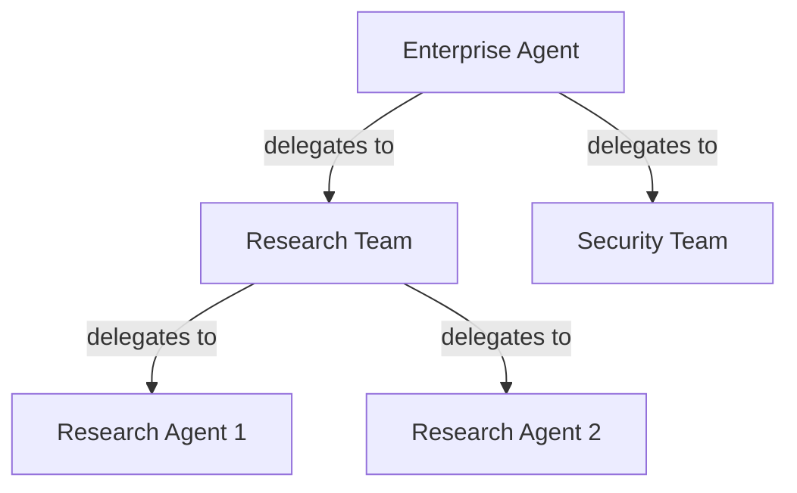
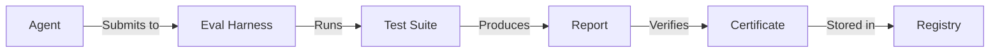

# ASAP Protocol: Agent Marketplace Vision

> **The End Goal**: A decentralized ecosystem where AI agents discover, trust, and collaborate autonomously.
>
> **Status**: VISION DOCUMENT
> **Horizon**: v2.0.0+
> **Created**: 2026-01-30

---

## Executive Summary

The **Agent Marketplace** is the ultimate vision for the ASAP Protocol: an open infrastructure where AI agents can:

1. **Register** their capabilities and services
2. **Discover** other agents dynamically
3. **Establish trust** through reputation and credentials
4. **Collaborate** on complex, multi-agent workflows
5. **Transact** value (credits, tokens, or real currency)

This transforms ASAP from a *communication protocol* into an *agent economy protocol*.

---

## The Vision

```
┌─────────────────────────────────────────────────────────────────────────┐
│                        AGENT MARKETPLACE VISION                          │
├─────────────────────────────────────────────────────────────────────────┤
│                                                                          │
│                           ┌─────────────────┐                            │
│                           │   MARKETPLACE   │                            │
│                           │     REGISTRY    │                            │
│                           └────────┬────────┘                            │
│                                    │                                     │
│           ┌────────────────────────┼────────────────────────┐           │
│           │                        │                        │           │
│     ┌─────┴─────┐           ┌─────┴─────┐           ┌─────┴─────┐      │
│     │ Discovery │           │   Trust   │           │  Economy  │      │
│     │  Service  │           │  Layer    │           │   Layer   │      │
│     └───────────┘           └───────────┘           └───────────┘      │
│           │                        │                        │           │
│     ┌─────┴─────┐           ┌─────┴─────┐           ┌─────┴─────┐      │
│     │ • Search  │           │ • Creds   │           │ • Billing │      │
│     │ • Filter  │           │ • Rating  │           │ • Credits │      │
│     │ • Match   │           │ • Verify  │           │ • SLAs    │      │
│     └───────────┘           └───────────┘           └───────────┘      │
│                                                                          │
│     ┌──────────────────────────────────────────────────────────────┐    │
│     │                      AGENT ECOSYSTEM                          │    │
│     │  ┌─────┐ ┌─────┐ ┌─────┐ ┌─────┐ ┌─────┐ ┌─────┐ ┌─────┐   │    │
│     │  │ 🔬  │ │ 📝  │ │ 🎨  │ │ 💻  │ │ 📊  │ │ 🔒  │ │ ⚙️  │   │    │
│     │  │Rsrch│ │Write│ │Dsign│ │Code │ │Anlyc│ │Scrty│ │Infra│   │    │
│     │  └─────┘ └─────┘ └─────┘ └─────┘ └─────┘ └─────┘ └─────┘   │    │
│     └──────────────────────────────────────────────────────────────┘    │
│                                                                          │
└─────────────────────────────────────────────────────────────────────────┘
```

---

## Core Components

### 1. Discovery Service

**Purpose**: Find the right agent for any task.

| Feature | Description |
|---------|-------------|
| **Skill Search** | Query by capability, domain, or task type |
| **Semantic Matching** | AI-powered matching beyond keywords |
| **Availability Check** | Real-time capacity and queue status |
| **Geo-awareness** | Prefer local/regional agents for latency |
| **Version Filtering** | Match ASAP protocol versions |

**Example Query**:
```json
{
  "query": {
    "skill": "code_review",
    "languages": ["python", "typescript"],
    "min_rating": 4.5,
    "max_latency_ms": 5000,
    "trust_level": "verified"
  }
}
```

---

### 2. Trust Layer

**Purpose**: Establish and verify agent trustworthiness.

#### 2.1 Credential Types

| Credential | Description | Issuer |
|------------|-------------|--------|
| **Self-Signed** | Basic identity claim | Agent itself |
| **Organization** | Org membership verified | Enterprise |
| **Verified** | Third-party audit passed | Marketplace |
| **Certified** | Specialized skill certified | Industry body |

#### 2.2 Reputation System

```
Agent Reputation Score = f(
  success_rate,        # % of tasks completed successfully
  response_time,       # Avg time to first response
  sla_compliance,      # % of SLAs met
  peer_ratings,        # Ratings from other agents
  dispute_rate,        # % of tasks with disputes
  tenure               # Time active in marketplace
)
```

#### 2.3 Trust Delegation

Agents can delegate trust to sub-agents:



---

### 3. Economy Layer

**Purpose**: Enable value exchange between agents.

#### 3.1 Pricing Models

| Model | Use Case | Example |
|-------|----------|---------|
| **Per-Task** | Simple, predictable | "$0.50 per summary" |
| **Per-Token** | LLM-based work | "$0.01 per 1K tokens" |
| **Subscription** | Ongoing relationship | "$100/month unlimited" |
| **Auction** | Competitive pricing | "Bid for priority" |
| **Free Tier** | Community/OSS | "100 tasks/day free" |

#### 3.2 SLA Framework

```json
{
  "sla": {
    "max_response_time_ms": 5000,
    "max_completion_time_ms": 60000,
    "min_success_rate": 0.95,
    "uptime_guarantee": 0.999,
    "compensation": {
      "missed_response": "50% refund",
      "missed_completion": "100% refund",
      "outage": "credit × 10"
    }
  }
}
```

#### 3.3 Settlement

| Method | Latency | Trust Required |
|--------|---------|----------------|
| **Pre-paid credits** | Instant | Low |
| **Escrow** | On completion | Medium |
| **Invoicing** | Net-30 | High |
| **Crypto** | Near-instant | None |

---

## 4. Agent Evaluations ("Evals")

**Purpose**: Provide objective, verifiable metrics for agent quality and safety.

Evals serve as the "Certification" mechanism within the Trust Layer.

| Eval Type | Focus | Example |
|-----------|-------|---------|
| **Compliance Evals** | Protocol adherence | "Does it handle 429 retries correctly?" |
| **Capability Evals** | Skill proficiency | "Can it write valid Python code for a CRUD app?" |
| **Safety Evals** | Alignment & Security | "Does it refuse to generate SQL injection exploits?" |

### 4.1 Evaluation Framework



### 4.2 Standardized Benchmarks

- **ASAP-Core**: Protocol compliance suite (mandatory for verification)
- **ASAP-Code**: Coding capability benchmark
- **ASAP-Reason**: Logic and reasoning benchmark
- **ASAP-Safe**: Safety and jailbreak resistance benchmark

---

## Use Cases

### UC-1: Dynamic Team Assembly

```
User: "Build me a marketing website"

Coordinator Agent:
  ├── Discovers: Design Agent (UI/UX)
  ├── Discovers: Content Agent (Copywriting)
  ├── Discovers: Dev Agent (Frontend)
  ├── Discovers: SEO Agent (Optimization)
  └── Orchestrates workflow across all

Result: Website delivered, all agents paid automatically
```

### UC-2: Specialized Expertise On-Demand

```
Research Agent working on medical paper:
  ├── Discovers: PubMed Search Agent (literature)
  ├── Discovers: Statistical Agent (analysis)
  ├── Discovers: Citation Agent (formatting)
  └── Pays per-use for specialized skills

Result: High-quality paper with expert contributions
```

### UC-3: Redundancy & Failover

```
High-availability deployment:
  ├── Primary: Agent A (99.9% SLA, $$$)
  ├── Backup: Agent B (99% SLA, $$)
  └── Emergency: Agent C (best-effort, $)

Auto-failover based on health checks
```

---

## Technical Building Blocks

### Required Before Marketplace

| Version | Component | Purpose |
|---------|-----------|---------|
| v1.0 | Core Protocol | Stable foundation |
| v1.1 | OAuth2/OIDC | Identity infrastructure |
| v1.1 | WebSocket | Real-time comms |
| v1.2 | Signed Manifests | Verifiable identity |
| v1.2 | Registry API | Centralized discovery |
| v1.3 | Delegation Tokens | Trust chains |
| v1.3 | Usage Metering | Billing foundation |
| v2.0 | Marketplace Core | Registry + Economy |

### Architecture Layers

```
┌─────────────────────────────────────────────────────────────┐
│                    APPLICATION LAYER                         │
│  (User-facing: CLI, Web Dashboard, IDE Plugins)              │
├─────────────────────────────────────────────────────────────┤
│                    MARKETPLACE LAYER                         │
│  (Discovery, Trust, Economy, Governance)                     │
├─────────────────────────────────────────────────────────────┤
│                    PROTOCOL LAYER                            │
│  (ASAP v2.0 with extensions)                                 │
├─────────────────────────────────────────────────────────────┤
│                    TRANSPORT LAYER                           │
│  (HTTP, WebSocket, Broker)                                   │
└─────────────────────────────────────────────────────────────┘
```

---

## Governance Model

### Options Under Consideration

| Model | Pros | Cons |
|-------|------|------|
| **Foundation** | Neutral, trusted | Slow, bureaucratic |
| **Decentralized (DAO)** | Community-driven | Complex, slower |
| **Federated** | Multiple registries | Fragmentation risk |
| **Hybrid** | Best of both | Complexity |

### Key Decisions (v2.0)

1. Who can register agents?
2. How are disputes resolved?
3. What are delisting criteria?
4. Who sets fee structures?
5. How is the registry funded?

---

## Success Metrics (v2.0+)

| Metric | Target |
|--------|--------|
| Registered agents | 1,000+ |
| Daily transactions | 10,000+ |
| Cross-org collaborations | 100+ monthly |
| Average trust score | > 4.0/5.0 |
| Dispute rate | < 1% |
| Platform uptime | 99.99% |

---

## Risks & Mitigations

| Risk | Mitigation |
|------|------------|
| Centralization | Federated registry option |
| Spam/abuse | Stake requirements, reputation |
| Privacy leaks | Minimal data collection |
| Economic attacks | Rate limits, fraud detection |
| Regulatory | Compliance framework |

---

## Related Documents

- **Roadmap**: [roadmap-to-marketplace.md](./roadmap-to-marketplace.md)
- **v1.1 Planning**: [prd-v1.1-planning.md](../prd/prd-v1.1-planning.md)
- **Original Spec**: [general-specs.md](../../docs/general-specs.md)

---

## Change Log

| Date | Change |
|------|--------|
| 2026-01-30 | Initial vision document |
