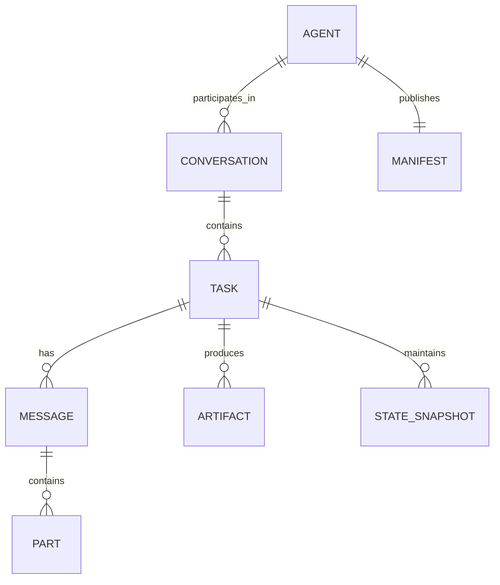
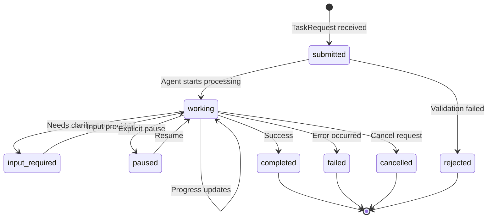
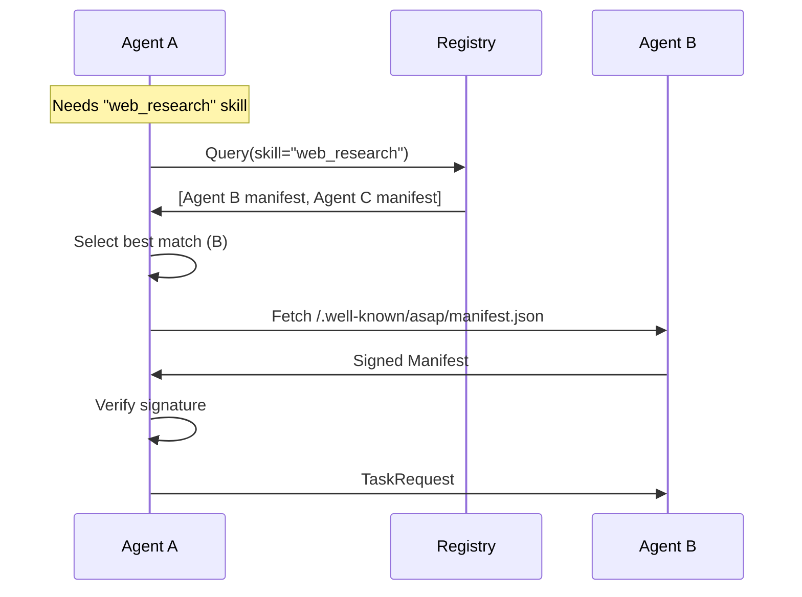
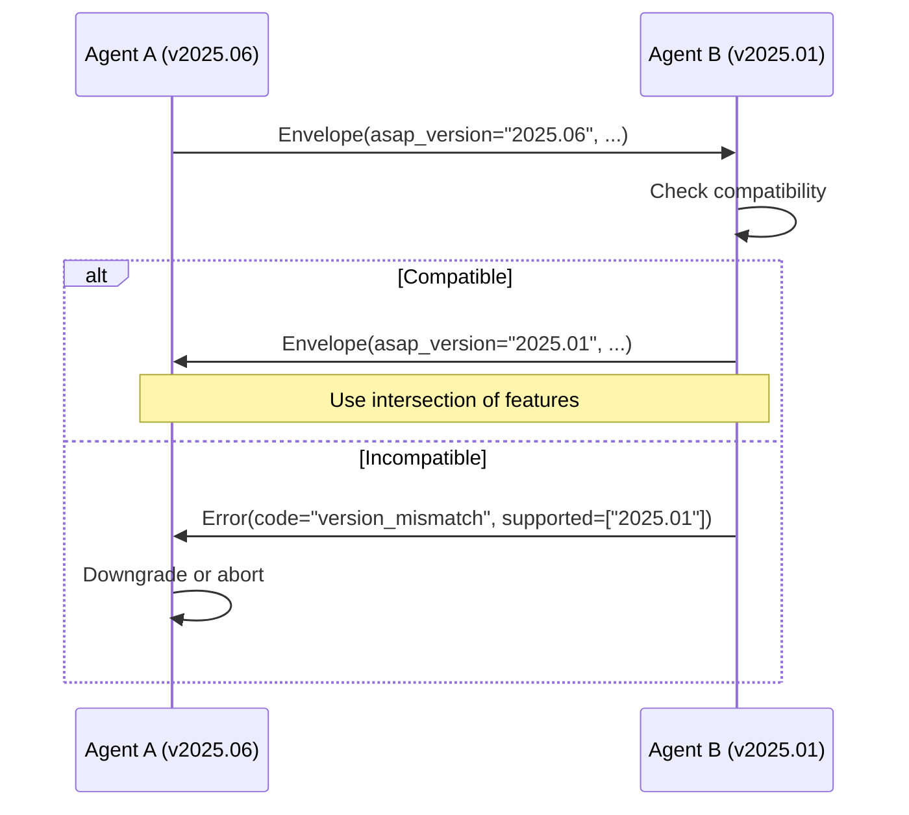
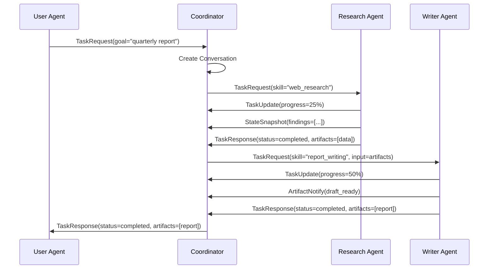
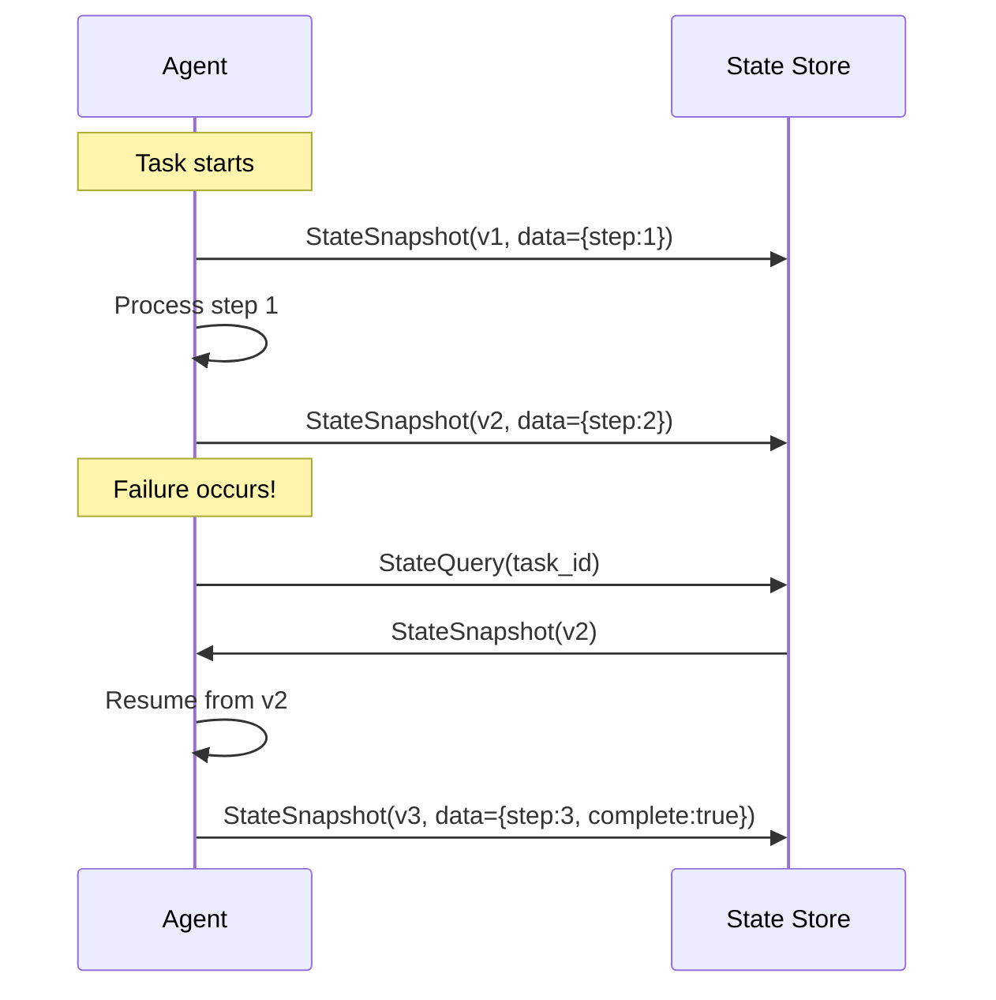

# ASAP: Async Simple Agent Protocol
## Protocol Specification v0.1 (DRAFT)

> A streamlined, scalable, asynchronous protocol for agent-to-agent communication and task coordination, inspired by A2A but simpler and more powerful, with MCP compatibility.

---

## Table of Contents

1. [Executive Summary](#1-executive-summary)
2. [Design Rationale](#2-design-rationale)
3. [Core Concepts](#3-core-concepts)
4. [Message Types](#4-message-types)
5. [State Model & Lifecycle](#5-state-model--lifecycle)
6. [Async Patterns](#6-async-patterns)
7. [Topology & Discovery](#7-topology--discovery)
8. [MCP Compatibility](#8-mcp-compatibility)
9. [Extensibility](#9-extensibility)
10. [Security Considerations](#10-security-considerations)
11. [Observability](#11-observability)
12. [Validation Criteria](#12-validation-criteria)
13. [Open Decisions](#13-open-decisions)
14. [MVP vs Future Scope](#14-mvp-vs-future-scope)

---

## 1. Executive Summary

**ASAP** (Async Simple Agent Protocol) is a protocol specification for task coordination between AI agents. It addresses key limitations in Google's A2A protocol while maintaining simplicity and MCP compatibility.

### Key Design Goals

| Goal | ASAP Approach |
|------|---------------|
| **Simplicity** | Single message primitive with typed payloads |
| **Scalability** | Pub/sub-ready, avoids N² connections |
| **State Management** | First-class persistent state with snapshots |
| **Async-first** | Non-blocking by default, sync as opt-in |
| **MCP Compatible** | Native envelope for MCP tool calls |
| **Peer-to-Peer** | Symmetric roles with optional orchestration |

### Protocol Principles

1. **Transport Agnostic** – Works over HTTP, WebSocket, NATS, or any message transport
2. **Schema-First** – JSON Schema for all payloads, enabling validation and codegen
3. **Idempotent by Design** – All operations are safe to retry
4. **Observable** – Built-in correlation and tracing support
5. **Composable** – Agents can be nested or chained without protocol changes

---

## 2. Design Rationale

### 2.1 Analysis of Existing Protocols

#### A2A (Google Agent2Agent) - Strengths

- Clear separation of concerns (agent-to-agent vs agent-to-tool)
- Task lifecycle with defined states
- Multi-modal support (TextPart, FilePart, DataPart)
- Enterprise-ready features (auth in Agent Card)

#### A2A - Weaknesses Addressed

| A2A Limitation | ASAP Solution |
|----------------|---------------|
| **N² scalability** (point-to-point HTTP) | Optional message broker topology |
| **No native state persistence** | First-class `StateSnapshot` type |
| **Discovery/trust gaps** | Capability-based discovery with signed manifests |
| **Semantic interoperability** | Shared vocabulary registry + schema negotiation |
| **Client/Server asymmetry** | Symmetric peer roles |
| **Fragmented protocol landscape** | MCP as embedded tool protocol |

#### MCP (Model Context Protocol) - Integration Points

- **Resources**: Map to ASAP `Resource` references
- **Tools**: Encapsulated in `McpToolCall` envelope
- **Prompts**: Expressible as `Template` payloads
- **Sampling**: Agent-initiated via `SamplingRequest`

### 2.2 Trade-off Analysis

```
┌─────────────────────────────────────────────────────────────────┐
│                    DESIGN TRADE-OFF MATRIX                      │
├─────────────────────┬─────────────────┬─────────────────────────┤
│ Dimension           │ ASAP Choice     │ Alternative Considered  │
├─────────────────────┼─────────────────┼─────────────────────────┤
│ Transport           │ Agnostic        │ HTTP-only (A2A style)   │
│ Serialization       │ JSON + optional │ Protobuf-only           │
│                     │ binary          │                         │
│ State model         │ Event-sourced   │ Mutable objects         │
│ Topology            │ Peer-to-peer    │ Hub-and-spoke           │
│ Identity            │ Self-sovereign  │ Centralized registry    │
│ Async pattern       │ Async-first     │ Sync-first with async   │
└─────────────────────┴─────────────────┴─────────────────────────┘
```

---

## 3. Core Concepts

### 3.1 Entities



#### Agent
An autonomous entity capable of sending and receiving ASAP messages. Agents are symmetric peers with no inherent client/server distinction.

```json
{
  "type": "Agent",
  "id": "urn:asap:agent:research-v1",
  "manifest_uri": "https://agents.example.com/.well-known/asap/research-v1.json",
  "capabilities": ["task.execute", "state.persist", "mcp.tools"]
}
```

#### Manifest
Self-describing metadata about an agent's capabilities (analogous to A2A's Agent Card but extended).

```json
{
  "$schema": "https://asap-protocol.org/schema/manifest/v1.json",
  "id": "urn:asap:agent:research-v1",
  "name": "Research Agent",
  "version": "1.0.0",
  "description": "Performs web research and summarization",
  "capabilities": {
    "asap_version": "0.1",
    "skills": [
      {
        "id": "web_research",
        "description": "Search and synthesize information from the web",
        "input_schema": { "$ref": "#/definitions/ResearchInput" },
        "output_schema": { "$ref": "#/definitions/ResearchOutput" }
      }
    ],
    "state_persistence": true,
    "streaming": true,
    "mcp_tools": ["web_search", "url_fetch"]
  },
  "endpoints": {
    "asap": "https://api.example.com/asap",
    "events": "wss://api.example.com/asap/events"
  },
  "auth": {
    "schemes": ["bearer", "oauth2"],
    "oauth2": {
      "authorization_url": "https://auth.example.com/authorize",
      "token_url": "https://auth.example.com/token",
      "scopes": ["asap:execute", "asap:read"]
    }
  },
  "signature": "eyJhbGciOiJFZDI1NTE5..."
}
```

#### Conversation
A context for related interactions between agents. Conversations enable:
- Shared context accumulation
- Task grouping and correlation
- State isolation between unrelated work

```json
{
  "type": "Conversation",
  "id": "conv_01HX5K3MQVN8...",
  "participants": ["urn:asap:agent:coordinator", "urn:asap:agent:research-v1"],
  "created_at": "2025-01-15T20:00:00Z",
  "metadata": {
    "purpose": "quarterly_report_research",
    "ttl_hours": 72
  }
}
```

#### Task
The fundamental unit of work. Tasks are:
- Uniquely identified
- Stateful with defined lifecycle
- Cancellable and resumable
- Capable of producing artifacts

```json
{
  "type": "Task",
  "id": "task_01HX5K4N...",
  "conversation_id": "conv_01HX5K3MQVN8...",
  "parent_task_id": null,
  "status": "working",
  "progress": {
    "percent": 45,
    "message": "Analyzing search results..."
  },
  "created_at": "2025-01-15T20:01:00Z",
  "updated_at": "2025-01-15T20:05:00Z"
}
```

#### Message
A single communication turn containing one or more parts.

```json
{
  "type": "Message",
  "id": "msg_01HX5K5P...",
  "task_id": "task_01HX5K4N...",
  "sender": "urn:asap:agent:coordinator",
  "role": "user",
  "parts": [
    {
      "type": "TextPart",
      "content": "Research Q3 market trends for AI infrastructure"
    }
  ],
  "timestamp": "2025-01-15T20:01:00Z"
}
```

#### Part
Atomic content unit within messages or artifacts.

| Part Type | Description | Key Fields |
|-----------|-------------|------------|
| `TextPart` | Plain text content | `content` |
| `DataPart` | Structured JSON data | `data`, `schema_uri` |
| `FilePart` | Binary or text file | `uri`, `mime_type`, `inline_data` |
| `ResourcePart` | Reference to MCP resource | `resource_uri` |
| `TemplatePart` | Parameterized prompt template | `template`, `variables` |

#### Artifact
Concrete output produced by task execution.

```json
{
  "type": "Artifact",
  "id": "art_01HX5K6Q...",
  "task_id": "task_01HX5K4N...",
  "name": "Q3 Market Analysis Report",
  "parts": [
    {
      "type": "FilePart",
      "uri": "asap://artifacts/task_01HX5K4N/report.pdf",
      "mime_type": "application/pdf"
    }
  ],
  "created_at": "2025-01-15T20:15:00Z"
}
```

#### StateSnapshot
First-class state persistence mechanism (addresses A2A limitation).

```json
{
  "type": "StateSnapshot",
  "id": "snap_01HX5K7R...",
  "task_id": "task_01HX5K4N...",
  "version": 3,
  "data": {
    "search_completed": true,
    "sources_analyzed": 15,
    "key_findings": ["..."]
  },
  "checkpoint": true,
  "created_at": "2025-01-15T20:10:00Z"
}
```

---

## 4. Message Types

ASAP uses a unified message envelope with typed payloads:

### 4.1 Envelope Structure

```json
{
  "$schema": "https://asap-protocol.org/schema/envelope/v1.json",
  "asap_version": "0.1",
  "id": "env_01HX5K8S...",
  "correlation_id": "req_external_123",
  "trace_id": "trace_01HX5K...",
  "timestamp": "2025-01-15T20:00:00Z",
  "sender": "urn:asap:agent:coordinator",
  "recipient": "urn:asap:agent:research-v1",
  "payload_type": "TaskRequest",
  "payload": { ... },
  "extensions": {}
}
```

### 4.2 Payload Types

#### Core Payloads

| Payload Type | Direction | Purpose |
|--------------|-----------|---------|
| `TaskRequest` | A → B | Request task execution |
| `TaskResponse` | B → A | Acknowledge/complete task |
| `TaskUpdate` | B → A | Progress or state change |
| `TaskCancel` | A → B | Request cancellation |
| `MessageSend` | A ↔ B | Exchange conversation turn |
| `StateQuery` | A → B | Request state snapshot |
| `StateRestore` | A → B | Restore from snapshot |
| `ArtifactNotify` | B → A | Signal artifact availability |

#### MCP Integration Payloads

| Payload Type | Purpose |
|--------------|---------|
| `McpToolCall` | Execute MCP tool via agent |
| `McpToolResult` | Return tool execution result |
| `McpResourceFetch` | Request MCP resource |
| `McpResourceData` | Return resource content |

### 4.3 Detailed Payload Schemas

#### TaskRequest

```json
{
  "payload_type": "TaskRequest",
  "payload": {
    "conversation_id": "conv_01HX5K3MQVN8...",
    "parent_task_id": null,
    "skill_id": "web_research",
    "input": {
      "query": "AI infrastructure market trends Q3 2025",
      "depth": "comprehensive"
    },
    "config": {
      "timeout_seconds": 600,
      "priority": "normal",
      "idempotency_key": "idem_01HX5K9T...",
      "streaming": true,
      "persist_state": true
    }
  }
}
```

#### TaskResponse

```json
{
  "payload_type": "TaskResponse",
  "payload": {
    "task_id": "task_01HX5K4N...",
    "status": "completed",
    "result": {
      "summary": "Analysis complete with 3 key findings...",
      "artifacts": ["art_01HX5K6Q..."]
    },
    "final_state": {
      "version": 5,
      "data": { ... }
    },
    "metrics": {
      "duration_ms": 45000,
      "tokens_used": 12500
    }
  }
}
```

#### TaskUpdate (Progress)

```json
{
  "payload_type": "TaskUpdate",
  "payload": {
    "task_id": "task_01HX5K4N...",
    "update_type": "progress",
    "status": "working",
    "progress": {
      "percent": 65,
      "message": "Synthesizing findings...",
      "estimated_remaining_seconds": 120
    }
  }
}
```

#### TaskUpdate (Input Required)

```json
{
  "payload_type": "TaskUpdate",
  "payload": {
    "task_id": "task_01HX5K4N...",
    "update_type": "input_required",
    "status": "input_required",
    "input_request": {
      "prompt": "Multiple interpretations found. Please clarify:",
      "options": [
        { "id": "opt_1", "label": "Focus on cloud infrastructure" },
        { "id": "opt_2", "label": "Focus on on-premise solutions" }
      ],
      "schema": { "$ref": "#/definitions/ClarificationInput" }
    }
  }
}
```

---

## 5. State Model & Lifecycle

### 5.1 Task States



### 5.2 State Definitions

| State | Description | Transitions To |
|-------|-------------|----------------|
| `submitted` | Task received, pending start | `working`, `rejected` |
| `working` | Actively processing | `completed`, `failed`, `cancelled`, `input_required`, `paused` |
| `input_required` | Awaiting user/agent input | `working`, `cancelled` |
| `paused` | Temporarily suspended | `working`, `cancelled` |
| `completed` | Successfully finished | *terminal* |
| `failed` | Error occurred | *terminal* |
| `cancelled` | Explicitly cancelled | *terminal* |
| `rejected` | Could not accept task | *terminal* |

### 5.3 State Persistence Model

ASAP supports **mode-selectable** state persistence:

| Mode | Description | When to Use |
|------|-------------|-------------|
| `snapshot` (default) | Simple checkpoint/restore | Short tasks (<1 hour), simple workflows |
| `event-sourced` (opt-in) | Full event history with replay | Long tasks, audit requirements, debugging |

> [!NOTE]
> Implementations MUST support `snapshot` mode. Event-sourced mode is RECOMMENDED for tasks exceeding 1 hour or requiring audit trails.

**Snapshot Mode** (Default):
```json
{
  "config": {
    "state_mode": "snapshot"
  }
}
```

**Event-Sourced Mode** (Opt-in):
```json
{
  "config": {
    "state_mode": "event-sourced",
    "event_retention_hours": 168
  }
}
```

### 5.4 Consistency Model

ASAP uses **causal consistency** for task state:

- Agents observing a task see updates in causal order
- A task cannot be "completed" before it was "working"
- Cross-agent state sharing uses eventual consistency with version vectors

---

## 6. Async Patterns

### 6.1 Design Philosophy

ASAP is **async-first** but supports synchronous patterns as an optimization:

| Pattern | Use Case | Mechanism |
|---------|----------|-----------|
| **Fire-and-forget** | Notifications, logging | No response expected |
| **Request-response** | Simple queries | Single response with timeout |
| **Streaming** | Progress, large outputs | Server-push via SSE/WebSocket |
| **Long-polling** | Legacy HTTP support | Periodic status checks |
| **Callback/webhook** | Disconnected agents | Push notification to URL |
| **Pub/sub** | Multi-agent coordination | Topic-based distribution |

### 6.2 Sync vs Async Trade-offs

```
┌─────────────────────────────────────────────────────────────────┐
│                    SYNC VS ASYNC COMPARISON                      │
├─────────────────────┬─────────────────────┬─────────────────────┤
│ Aspect              │ Sync (opt-in)       │ Async (default)     │
├─────────────────────┼─────────────────────┼─────────────────────┤
│ Latency perception  │ Blocking wait       │ Immediate ack       │
│ Error handling      │ Inline              │ Separate channel    │
│ Scalability         │ Connection-bound    │ Decoupled           │
│ Complexity          │ Lower               │ Higher              │
│ Long-running tasks  │ Timeout risk        │ Natural fit         │
│ Human-in-the-loop   │ Awkward             │ Natural fit         │
└─────────────────────┴─────────────────────┴─────────────────────┘
```

### 6.3 Async Delivery Mechanisms

#### Streaming (Real-time)

```json
{
  "config": {
    "streaming": true,
    "stream_endpoint": "wss://api.example.com/asap/stream"
  }
}
```

Events delivered as newline-delimited JSON (NDJSON) or SSE.

#### Webhook Callbacks

```json
{
  "config": {
    "callback_url": "https://my-agent.example.com/asap/callback",
    "callback_events": ["status_change", "artifact_ready"],
    "callback_secret": "whsec_..."
  }
}
```

#### Message Broker Integration

For scalable multi-agent systems:

```json
{
  "config": {
    "broker": {
      "type": "nats",
      "subject_prefix": "asap.tasks",
      "reply_subject": "asap.replies.agent-coordinator"
    }
  }
}
```

---

## 7. Topology & Discovery

### 7.1 Deployment Patterns

ASAP recommends deployment patterns based on context, not a single default:

| Pattern | Agents | Trust | Use Case | Transport |
|---------|--------|-------|----------|----------|
| **Direct** | ≤5 | Single domain | Dev, prototyping | HTTP point-to-point |
| **Orchestrated** | ≤20 | Enterprise | Production workflows | HTTP via coordinator |
| **Mesh** | Unlimited | Federated | Large-scale, multi-org | Message broker |

> [!IMPORTANT]
> Choose deployment pattern based on scale and trust requirements. Direct connections suit small teams; mesh topology scales better.

### 7.2 Direct Connections

**When to use**: ≤5 agents in single trust domain, development/testing.

```json
{
  "deployment": {
    "pattern": "direct",
    "peer_endpoints": [
      "https://agent-a.local/asap",
      "https://agent-b.local/asap"
    ]
  }
}
```

### 7.3 Orchestrated Pattern

**When to use**: Enterprise deployments requiring audit, ≤20 agents.

```json
{
  "deployment": {
    "pattern": "orchestrated",
    "coordinator": "https://coordinator.example.com/asap"
  }
}
```

### 7.4 Mesh Pattern

**When to use**: Scale beyond 20 agents, cross-organization coordination.

```json
{
  "deployment": {
    "pattern": "mesh",
    "broker": {
      "type": "nats",
      "url": "nats://broker.example.com:4222"
    }
  }
}
```

### 7.4 Discovery Mechanisms



**Discovery Options**:

1. **Well-known URI**: `/.well-known/asap/manifest.json`
2. **DNS-SD**: `_asap._tcp.example.com`
3. **Registry API**: Centralized capability index
4. **Gossip**: Peer-based discovery (future)

---

## 8. MCP Compatibility

### 8.1 Design Philosophy

MCP is embedded as a **tool execution substrate**, not replaced:

```
┌─────────────────────────────────────────────────────────────────┐
│                    ASAP + MCP RELATIONSHIP                       │
├─────────────────────────────────────────────────────────────────┤
│                                                                  │
│   ┌─────────────────────────────────────────────────────────┐   │
│   │                     ASAP Protocol                        │   │
│   │   (Agent ↔ Agent Communication)                          │   │
│   │                                                          │   │
│   │   ┌──────────────────────────────────────────────────┐  │   │
│   │   │                     MCP Layer                     │  │   │
│   │   │   (Agent ↔ Tool Execution)                        │  │   │
│   │   │                                                   │  │   │
│   │   │   ┌────────┐  ┌────────┐  ┌────────┐            │  │   │
│   │   │   │ Tool 1 │  │ Tool 2 │  │ Tool 3 │            │  │   │
│   │   │   └────────┘  └────────┘  └────────┘            │  │   │
│   │   └──────────────────────────────────────────────────┘  │   │
│   └─────────────────────────────────────────────────────────┘   │
│                                                                  │
└─────────────────────────────────────────────────────────────────┘
```

### 8.2 MCP Envelope Types

#### McpToolCall

When an ASAP agent needs another agent to execute an MCP tool:

```json
{
  "payload_type": "McpToolCall",
  "payload": {
    "request_id": "mcp_req_01HX5K...",
    "tool_name": "web_search",
    "arguments": {
      "query": "AI infrastructure trends",
      "max_results": 10
    },
    "mcp_context": {
      "server_uri": "mcp://tools.example.com/web",
      "capabilities": ["search", "fetch"]
    }
  }
}
```

#### McpToolResult

```json
{
  "payload_type": "McpToolResult",
  "payload": {
    "request_id": "mcp_req_01HX5K...",
    "success": true,
    "result": {
      "content": [
        {
          "type": "text",
          "text": "Search results for 'AI infrastructure trends'..."
        }
      ]
    },
    "metadata": {
      "tokens_used": 150,
      "cached": false
    }
  }
}
```

### 8.3 MCP Mapping Table

| MCP Concept | ASAP Representation |
|-------------|---------------------|
| Tool | Skill with `mcp_tool` flag |
| Resource | `ResourcePart` in message |
| Prompt | `TemplatePart` in message |
| Sampling | `SamplingRequest` payload |
| Server | Agent with MCP capabilities |

### 8.4 Non-Invasive Integration

MCP compatibility is achieved via:

1. **Passthrough mode**: Agent forwards MCP calls unchanged
2. **Adapter pattern**: ASAP envelope wraps MCP messages
3. **Capability negotiation**: Manifest declares MCP support

```json
{
  "capabilities": {
    "mcp": {
      "version": "2025-11-25",
      "tools": ["web_search", "url_fetch", "code_exec"],
      "resources": true,
      "sampling": true
    }
  }
}
```

---

## 9. Extensibility

### 9.1 Extension Points

| Extension Point | Purpose | Mechanism |
|-----------------|---------|-----------|
| **Payload types** | New message types | Schema registration |
| **Part types** | New content formats | Schema + handler |
| **Capabilities** | New agent features | Manifest extension |
| **Middleware** | Cross-cutting concerns | Interceptor hooks |
| **Transport** | New protocols | Binding specification |

### 9.2 Extension Namespace

Extensions use reverse-domain naming:

```json
{
  "extensions": {
    "com.example.billing": {
      "cost_estimate_usd": 0.15,
      "budget_remaining": 42.50
    },
    "org.openai.usage": {
      "prompt_tokens": 500,
      "completion_tokens": 1200
    }
  }
}
```

### 9.3 Versioning Strategy

ASAP uses **hybrid versioning**: `Major.YYYY.MM`

| Component | Meaning | Example |
|-----------|---------|--------|
| Major | Breaking change indicator | `1`, `2` |
| YYYY.MM | Release timing | `2025.01` |

**Examples**:
- `1.2025.01` – Initial stable release
- `1.2025.06` – Additive, backward-compatible update  
- `2.2026.01` – Breaking changes (1 year notice required)

**Rationale**: Combines breaking-change clarity (SemVer) with recency indication (CalVer). Aligns with MCP's date-based approach while adding semantic meaning.

### 9.4 Negotiation Protocol



---

## 10. Security Considerations

### 10.1 MVP Security (Included)

| Feature | Implementation |
|---------|----------------|
| **Transport security** | TLS 1.3 required |
| **Authentication** | Bearer tokens, API keys |
| **Authorization** | Scope-based (declared in manifest) |
| **Correlation tracking** | Trace IDs for audit |
| **Input validation** | JSON Schema enforcement |
| **Rate limiting** | Agent-specified in manifest |
| **Request signing** (optional) | HMAC-SHA256 via `X-ASAP-Signature` header |

> [!NOTE]
> Request signing is RECOMMENDED for production deployments. Provides integrity verification without full PKI complexity.

### 10.2 Future Security (Deferred)

| Feature | Rationale for Deferral | Upgrade Path |
|---------|------------------------|--------------|
| **Signed messages** | Complexity, key management | Add `signature` field |
| **mTLS** | Operational overhead | Transport config |
| **Zero-trust** | Requires identity infra | Capability tokens |
| **Encryption at rest** | Implementation-specific | State provider plugins |
| **Audit logging** | Varies by deployment | Extension point |

### 10.3 Threat Model Awareness

```
┌─────────────────────────────────────────────────────────────────┐
│                    KEY THREATS ADDRESSED                         │
├─────────────────────────────────────────────────────────────────┤
│                                                                  │
│  ✅ Spoofing        → Manifest signatures, TLS                  │
│  ✅ Tampering       → Schema validation, checksums               │
│  ✅ Repudiation     → Correlation IDs, trace logs               │
│  ✅ Info Disclosure → Scope-based auth, minimal payloads        │
│  ✅ DoS             → Rate limits, timeouts                     │
│  ⏳ Elevation       → Future: capability-based access            │
│                                                                  │
└─────────────────────────────────────────────────────────────────┘
```

### 10.4 Error Taxonomy

Standard error codes ensure consistent handling across implementations:

```
asap:protocol
├── malformed_envelope    # Invalid JSON or missing required fields
├── invalid_payload_type  # Unknown payload type
└── version_mismatch      # Incompatible protocol versions

asap:routing
├── agent_not_found       # Target agent doesn't exist
├── agent_unreachable     # Network/timeout failure
└── conversation_expired  # Conversation TTL exceeded

asap:capability
├── skill_not_found       # Agent doesn't have requested skill
├── skill_unavailable     # Skill temporarily unavailable
└── input_validation      # Input doesn't match schema

asap:execution
├── task_failed           # Unrecoverable execution error
├── task_timeout          # Exceeded timeout_seconds
└── task_cancelled        # Cancelled by requester

asap:resource
├── quota_exceeded        # Usage limits reached
├── rate_limited          # Too many requests
└── storage_full          # State storage capacity

asap:security
├── auth_required         # No credentials provided
├── auth_invalid          # Invalid/expired credentials
└── permission_denied     # Insufficient scope
```

---

## 11. Observability

### 11.1 Built-in Support

Every ASAP message includes:

```json
{
  "id": "env_01HX5K8S...",
  "correlation_id": "req_external_123",
  "trace_id": "trace_01HX5K...",
  "span_id": "span_01HX5K...",
  "timestamp": "2025-01-15T20:00:00.123Z"
}
```

### 11.2 Metrics Exposure

Agents SHOULD expose metrics at `/asap/metrics`:

| Metric | Type | Description |
|--------|------|-------------|
| `asap_tasks_total` | Counter | Total tasks by status |
| `asap_task_duration_seconds` | Histogram | Task execution time |
| `asap_messages_total` | Counter | Messages by payload type |
| `asap_errors_total` | Counter | Errors by code |
| `asap_payload_bytes` | Histogram | Message sizes |

### 11.3 Idempotency

All requests support idempotency via `idempotency_key`:

```json
{
  "config": {
    "idempotency_key": "idem_01HX5K9T..."
  }
}
```

**Semantics**:
- Retry with same key → Return cached result
- Key expiry: Configurable, default 24 hours
- Scope: Per-agent, per-skill

---

## 12. Validation Criteria

### 12.1 Core Consistency Checks

| Criterion | Validation Method | Status |
|-----------|-------------------|--------|
| Multi-step task coordination | Sequence diagram walkthrough | ✅ Validated |
| Long-lived state representation | StateSnapshot with versioning | ✅ Validated |
| MCP compatibility non-invasive | Envelope wrapper, passthrough mode | ✅ Validated |
| Graceful version negotiation | Downgrade protocol defined | ✅ Validated |
| Idempotent operations | Idempotency key semantics | ✅ Validated |

### 12.2 Multi-Step Task Example



### 12.3 Long-Lived State Example



---

## 13. Open Decisions

> [!IMPORTANT]
> The following decisions require further analysis or stakeholder input before finalization.

### 13.1 Transport Binding Priority

**Question**: Which transport binding should be the canonical reference implementation?

| Option | Pros | Cons |
|--------|------|------|
| HTTP + JSON-RPC | A2A compatibility, familiar | Streaming complexity |
| HTTP + REST | Simpler mental model | Less structured |
| WebSocket | Native streaming | Connection management |
| gRPC | Strong typing, streaming | Heavier tooling |

**Recommendation**: HTTP + JSON-RPC for MVP (A2A alignment), WebSocket for streaming.

### 13.2 State Storage Specification

**Question**: Should ASAP prescribe a state storage interface?

**Options**:
1. **Opaque** – Implementation-defined (current)
2. **Interface-defined** – Abstract storage interface in spec
3. **Reference implementation** – SQLite/Redis reference

**Recommendation**: Option 2 (interface) for interoperability without mandating technology.

### 13.3 Discovery Registry Governance

**Question**: Who operates the capability registry for discovery?

**Options**:
- Self-hosted by deployments
- Federated network (like DNS)
- Centralized foundation-operated

**Recommendation**: Defer; start with well-known URI + optional self-hosted registry.

### 13.4 Error Code Registry

**Question**: How are error codes standardized and extended?

**Recommendation**: Define core codes in spec, allow namespaced extensions:

```json
{
  "error": {
    "code": "asap:task_rejected",
    "message": "Skill not available",
    "details": {
      "com.example.quota": {
        "exceeded": true
      }
    }
  }
}
```

---

## 14. MVP vs Future Scope

### 14.1 MVP Boundary

```
┌─────────────────────────────────────────────────────────────────┐
│                         MVP SCOPE                                │
├─────────────────────────────────────────────────────────────────┤
│                                                                  │
│  ✅ INCLUDED                      ⏳ DEFERRED                    │
│  ─────────────────────────────    ────────────────────────────  │
│  • Core message types             • Federated discovery          │
│  • Task lifecycle (full)          • Signed manifests             │
│  • State snapshots                • mTLS authentication          │
│  • MCP tool envelope              • Agent marketplaces           │
│  • HTTP + JSON-RPC binding        • gRPC binding                 │
│  • Streaming (SSE)                • WebSocket binding            │
│  • Webhook callbacks              • Pub/sub broker binding       │
│  • Well-known discovery           • DNS-SD discovery             │
│  • Bearer/API key auth            • OAuth2/OIDC flows            │
│  • Basic observability            • Distributed tracing          │
│  • Idempotency                    • Exactly-once delivery        │
│                                                                  │
└─────────────────────────────────────────────────────────────────┘
```

### 14.2 Future Roadmap

| Version | Focus Area | Key Additions |
|---------|------------|---------------|
| v0.2 | Transport | WebSocket binding, gRPC binding |
| v0.3 | Security | Signed manifests, mTLS option |
| v0.4 | Discovery | Registry API, DNS-SD |
| v1.0 | Stability | Frozen spec, conformance tests |
| v1.1 | Enterprise | OAuth2 flows, audit logging |
| v2.0 | Federation | Cross-domain trust, delegation |

---

## Appendix A: Schema Definitions

Full JSON Schema definitions available at:
- Envelope: `https://asap-protocol.org/schema/envelope/v1.json`
- Manifest: `https://asap-protocol.org/schema/manifest/v1.json`
- Payloads: `https://asap-protocol.org/schema/payloads/v1.json`

---

## Appendix B: Example Flows

### B.1 Simple Task Execution

```json
// Request
{
  "asap_version": "0.1",
  "id": "env_001",
  "sender": "urn:asap:agent:user",
  "recipient": "urn:asap:agent:assistant",
  "payload_type": "TaskRequest",
  "payload": {
    "skill_id": "summarize",
    "input": { "text": "Lorem ipsum..." }
  }
}

// Response
{
  "asap_version": "0.1",
  "id": "env_002",
  "correlation_id": "env_001",
  "sender": "urn:asap:agent:assistant",
  "recipient": "urn:asap:agent:user",
  "payload_type": "TaskResponse",
  "payload": {
    "task_id": "task_001",
    "status": "completed",
    "result": { "summary": "Summary text..." }
  }
}
```

### B.2 Multi-Turn with State

See [Section 12.2](#122-multi-step-task-example) for full sequence diagram.

---

## Verification Plan

Since this is a **design-only phase** (no code implementation), verification is performed via:

### Reasoning Validation

1. ✅ **Multi-step coordination**: Validated via sequence diagrams in Section 12.2
2. ✅ **State persistence**: Validated via StateSnapshot model in Section 5.3
3. ✅ **MCP compatibility**: Validated via non-invasive envelope approach in Section 8
4. ✅ **Version evolution**: Validated via negotiation protocol in Section 9.4

### Manual Review Checklist

- [ ] Core concepts are clearly defined
- [ ] Message types cover essential workflows
- [ ] State model supports failure recovery
- [ ] MCP integration is non-invasive
- [ ] Extensibility doesn't require breaking changes
- [ ] Security upgrade path is clear
- [ ] Open decisions are explicitly documented

---

## Change Log

| Date | Version | Change |
|------|---------|--------|
| 2025-01-15 | 0.1-draft | Initial specification |
