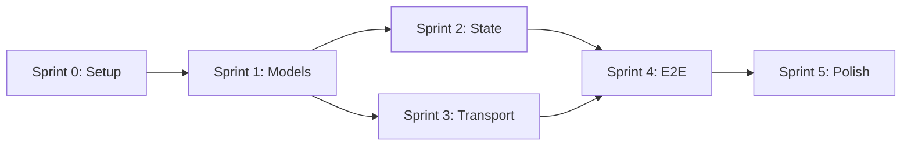

# ASAP Protocol: Sprint Plan

> Desenvolvimento incremental com entregas a cada sprint.

---

## Visão Geral

| Sprint | Foco | Entregável Demonstrável | Duração |
|--------|------|-------------------------|---------|
| **0** | Setup | Projeto rodando, CI verde | 0.5 dia |
| **1** | Models | Schemas JSON exportados | 1.5 dias |
| **2** | State | Task state machine funcionando | 1 dia |
| **3** | Transport | Agente respondendo via HTTP | 1.5 dias |
| **4** | E2E | Dois agentes dialogando | 1 dia |
| **5** | Polish | Package publicável | 1 dia |

**Total**: ~6.5 dias

---

## Sprint 0: Project Setup

**Objetivo**: Fundação do projeto com tooling e CI.

### Tarefas

- [ ] Criar repositório no GitHub com nome asap-protocol
- [ ] Criar estrutura de diretórios
- [ ] Configurar `pyproject.toml` (Poetry/PDM)
- [ ] Setup pytest + pytest-asyncio
- [ ] Configurar ruff (linting) + black (formatting)
- [ ] GitHub Actions: lint + test
- [ ] README básico com badge de CI (ou atualizar o README existente)
- [ ] Primeiro commit e push (criando o repo) pedindo confirmação ao usuário.

### Definição de Pronto
✅ Repositório criado e disponível no GitHub
✅ `pytest` roda sem erros (mesmo sem testes ainda)
✅ CI passa com status verde

### Estrutura Inicial

```
asap-protocol/
├── src/asap/
│   └── __init__.py          # version only
├── tests/
│   └── __init__.py
├── pyproject.toml
├── README.md
└── .github/workflows/ci.yml
```

---

## Sprint 1: Core Models

**Objetivo**: Todos os modelos Pydantic com JSON Schema export.

### Fase 1A: Entities (0.5 dia)

- [ ] `models/base.py` - BaseModel com configurações comuns
- [ ] `models/ids.py` - ULID generation helpers
- [ ] `models/entities.py`:
  - [ ] `Agent`
  - [ ] `Manifest`
  - [ ] `Conversation`
  - [ ] `Task`
  - [ ] `Message`
  - [ ] `Artifact`
  - [ ] `StateSnapshot`
- [ ] Testes unitários para cada entity

### Fase 1B: Parts (0.5 dia)

- [ ] `models/parts.py`:
  - [ ] `TextPart`
  - [ ] `DataPart`
  - [ ] `FilePart`
  - [ ] `ResourcePart`
  - [ ] `TemplatePart`
  - [ ] `Part` (união discriminada)
- [ ] Testes de serialização/deserialização

### Fase 1C: Payloads + Envelope (0.5 dia)

- [ ] `models/payloads.py`:
  - [ ] `TaskRequest`, `TaskResponse`, `TaskUpdate`, `TaskCancel`
  - [ ] `MessageSend`, `StateQuery`, `StateRestore`, `ArtifactNotify`
  - [ ] `McpToolCall`, `McpToolResult`, `McpResourceFetch`, `McpResourceData`
  - [ ] `Payload` (união discriminada por `payload_type`)
- [ ] `models/envelope.py`:
  - [ ] `Envelope` com auto-gen de id, timestamp
- [ ] Testes de envelope creation

### Definição de Pronto
✅ `from asap.models import Envelope, TaskRequest` funciona
✅ `schemas/` contém JSON Schemas gerados
✅ 100% dos modelos têm testes

---

## Sprint 2: State Machine

**Objetivo**: Gerenciamento de estado de Task funcional.

### Tarefas

- [ ] `state/machine.py`:
  - [ ] Enum `TaskStatus` com todos os estados
  - [ ] Dict `VALID_TRANSITIONS`
  - [ ] Função `can_transition(from, to) -> bool`
  - [ ] Função `transition(task, new_status) -> Task` (com validação)
  - [ ] Exception `InvalidTransitionError`
- [ ] `state/snapshot.py`:
  - [ ] Classe `SnapshotStore` (interface)
  - [ ] Implementação `InMemorySnapshotStore`
  - [ ] Métodos: `save(snapshot)`, `get(task_id, version?)`, `list_versions(task_id)`
- [ ] Testes da state machine
- [ ] Testes do snapshot store

### Definição de Pronto
✅ `task.transition("completed")` funciona ou levanta erro
✅ Snapshots podem ser salvos e restaurados
✅ Testes cobrem todas as transições

---

## Sprint 3: HTTP Transport

**Objetivo**: Servidor FastAPI recebendo mensagens ASAP.

### Fase 3A: Server (1 dia)

- [ ] `transport/server.py`:
  - [ ] FastAPI app factory
  - [ ] Endpoint POST `/asap` recebendo JSON-RPC
  - [ ] Handler registry (payload_type → handler)
  - [ ] Endpoint GET `/.well-known/asap/manifest.json`
- [ ] `transport/handlers.py`:
  - [ ] `TaskRequestHandler` base (echo response)
- [ ] Testes com TestClient

### Fase 3B: Client (0.5 dia)

- [ ] `transport/client.py`:
  - [ ] Classe `ASAPClient` (async context manager)
  - [ ] Método `send(envelope) -> Envelope`
  - [ ] Auto-retry com idempotency_key
- [ ] Testes de client (mock server)

### Definição de Pronto
✅ Servidor roda com `uvicorn asap.transport.server:app`
✅ Client consegue enviar TaskRequest e receber TaskResponse
✅ Manifest acessível via curl

---

## Sprint 4: Integração E2E

**Objetivo**: Demonstração funcional com 2 agentes.

### Tarefas

- [ ] `examples/echo_agent.py`:
  - [ ] Agente que retorna input como output
  - [ ] Usa ASAPClient para responder
- [ ] `examples/coordinator.py`:
  - [ ] Envia TaskRequest para echo_agent
  - [ ] Recebe e imprime TaskResponse
- [ ] `examples/run_demo.py`:
  - [ ] Script que sobe ambos e executa fluxo
- [ ] Teste E2E automatizado

### Definição de Pronto
✅ Demo roda: `python examples/run_demo.py`
✅ Output mostra TaskRequest → TaskResponse completo
✅ Trace IDs correlacionados nos logs

---

## Sprint 5: Polish & Package

**Objetivo**: Pronto para publicação.

### Tarefas

- [ ] Docstrings em todas as classes públicas
- [ ] README completo:
  - [ ] Instalação
  - [ ] Quick start
  - [ ] Exemplos
  - [ ] Link para spec
- [ ] CHANGELOG.md atualizado
- [ ] `pyproject.toml` metadata completa
- [ ] CLI básica: `asap --version`
- [ ] Publicar em TestPyPI para validação

### Definição de Pronto
✅ `pip install asap-protocol` funciona (TestPyPI)
✅ README permite começar em <5 min
✅ `asap --version` mostra versão correta

---

## Critérios de Transição entre Sprints

| De → Para | Gate |
|-----------|------|
| 0 → 1 | CI verde, estrutura criada |
| 1 → 2 | Todos os models exportam JSON Schema |
| 2 → 3 | State machine tem 100% cobertura |
| 3 → 4 | Server responde a curl com echo |
| 4 → 5 | Demo E2E funciona sem erros |

---

## Dependências entre Tarefas



---

## Riscos e Mitigações

| Risco | Probabilidade | Impacto | Mitigação |
|-------|---------------|---------|-----------|
| Pydantic v2 breaking changes | Baixa | Alto | Pin version, testes |
| JSON-RPC edge cases | Média | Médio | Usar lib `jsonrpcserver` |
| Async complexity | Média | Médio | Exemplos claros, docs |
| Schema drift | Baixa | Alto | Gerar schemas em CI |
