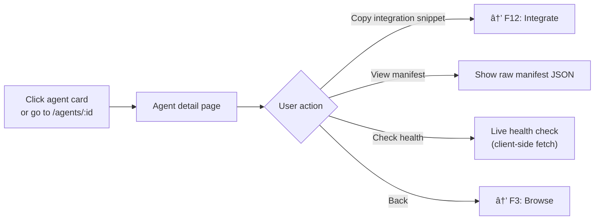
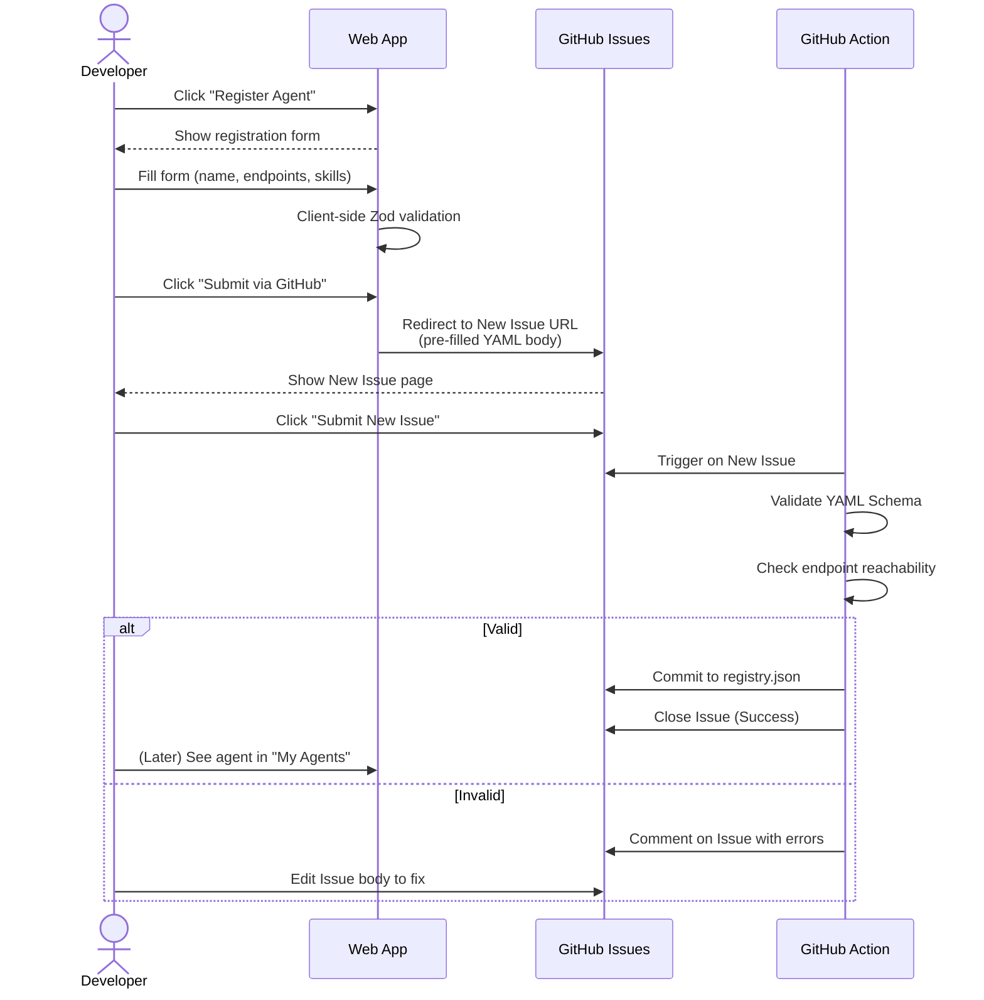
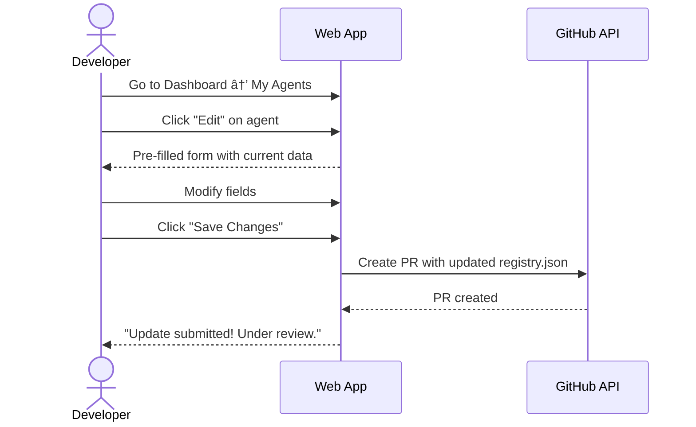
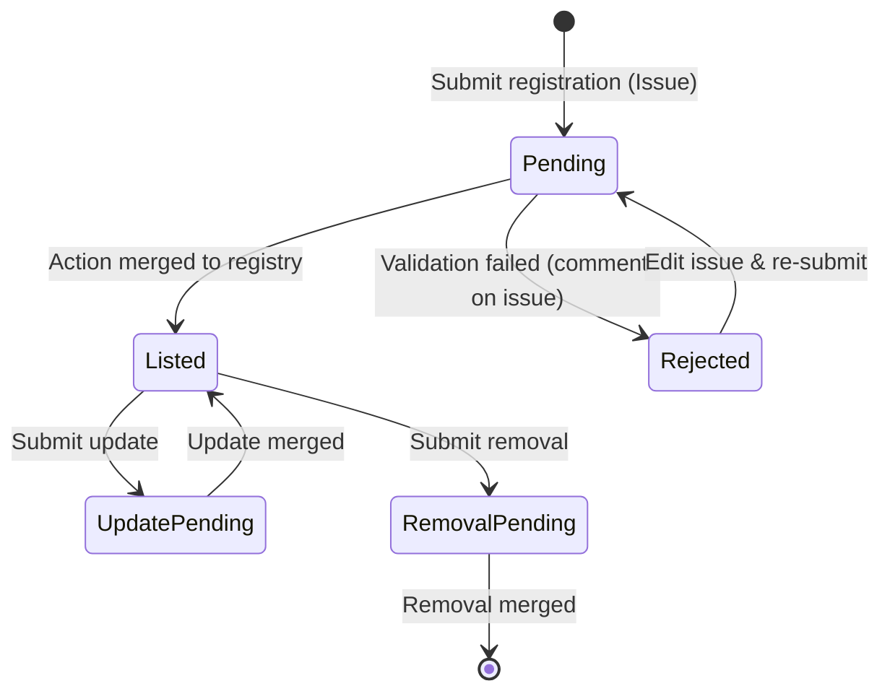
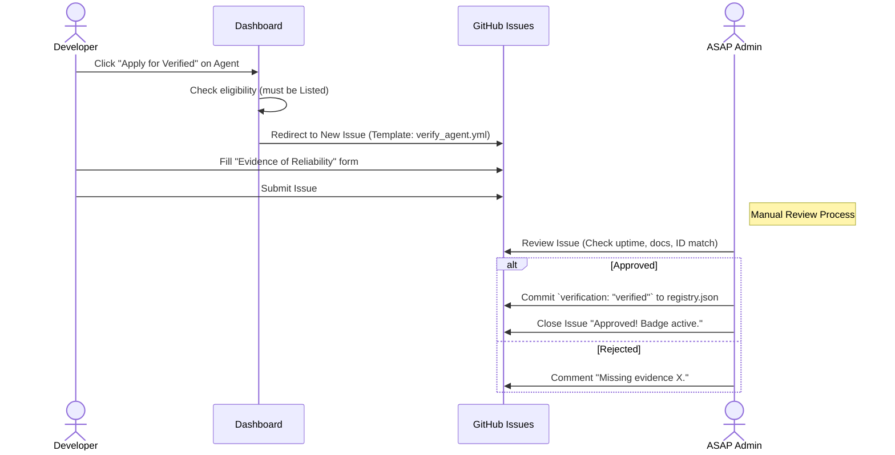

```mermaid
flowchart LR
    A["Visitor lands on\nasap-protocol.com"] --> B["Hero section:\nvalue proposition"]
    B --> C{"CTA choice"}
    C -->|Browse Agents| D["→ F3: Browse"]
    C -->|Register Agent| E["→ F5: Register"]
    C -->|Learn More| F["→ Docs (MkDocs)"]
```

# User Flows — ASAP Marketplace

> **Type**: User Journey Specification
> **Created**: 2026-02-12
> **Last Updated**: 2026-02-21
> **Status**: DRAFT — Iterating
>
> Maps every user-facing journey to guide front-end and back-end implementation.

---

## Personas

| Persona | Who | Goal | Auth |
|---------|-----|------|------|
| **Visitor** | Anyone browsing the marketplace | Discover agents, understand ASAP | None |
| **Agent Developer** (Provider) | Developer who builds and registers agents | List agent, manage profile, get discovered | GitHub OAuth |
| **Agent Consumer** | Developer/team who wants to use agents | Find, evaluate, and integrate agents | GitHub OAuth (optional) |
| **Platform Admin** | ASAP team member | Approve registrations, manage verified badges | Internal (GitHub org) |

---

## Flow Index

| # | Flow | Persona | Version | Priority | ADR/SD |
|---|------|---------|---------|----------|--------|
| F1 | [Landing Page Visit](#f1-landing-page-visit) | Visitor | v2.0 | P1 | — |
| F2 | [Developer Login](#f2-developer-login) | Developer / Consumer | v2.0 | P1 | ADR-18 |
| F3 | [Browse & Search Agents](#f3-browse--search-agents) | Visitor / Consumer | v2.0 | P1 | SD-11 |
| F4 | [View Agent Details](#f4-view-agent-details) | Visitor / Consumer | v2.0 | P1 | — |
| F5 | [Register Agent](#f5-register-agent) | Developer | v2.0 | P1 | ADR-18 |
| F6 | [Update Agent Listing](#f6-update-agent-listing) | Developer | v2.0 | P2 | ADR-18 |
| F7 | [Remove Agent](#f7-remove-agent) | Developer | v2.0 | P2 | — |
| F8 | [Developer Dashboard](#f8-developer-dashboard) | Developer | v2.0 | P1 | — |
| F9 | [Apply for Verified Badge](#f9-apply-for-verified-badge) | Developer | v2.0 | P1 | — |
| F10 | [Admin: Review Registration](#f10-admin-review-registration) | Admin | v2.0 | P1 | ADR-18 |
| F11 | [Admin: Review Verified Application](#f11-admin-review-verified-application) | Admin | v2.0 | P1 | — |
| F12 | [Integrate Agent (Copy SDK Snippet)](#f12-integrate-agent) | Consumer | v2.0 | P2 | — |

---

## F1: Landing Page Visit

**Persona**: Visitor
**Goal**: Understand ASAP Marketplace value proposition and navigate to key actions

### Journey



### Screens

| Screen | Key Elements |
|--------|-------------|
| **Landing** | Hero banner, agent count badge, featured agents carousel, "Browse Agents" CTA, "Register Your Agent" CTA, how-it-works section |

### Acceptance Criteria

- [ ] Page loads in < 2s (Lighthouse performance > 90)
- [ ] SEO: proper `<title>`, `<meta description>`, Open Graph tags
- [ ] Featured agents sourced from `registry.json`
- [ ] CTAs navigate to correct flows
- [ ] Responsive: desktop, tablet, mobile

---

## F2: Developer Login

**Persona**: Agent Developer / Agent Consumer
**Goal**: Authenticate via GitHub to access protected features (dashboard, registration)

### Journey


### Technical Notes

| Concern | Detail |
|---------|--------|
| **OAuth scopes** | `read:user` (profile), `public_repo` (to create PRs on registry repo) |
| **Session** | Server-side JWT stored in `httpOnly` cookie |
| **Token storage** | GitHub access token encrypted + stored in session (needed for PR creation in F5) |
| **Logout** | Clear session cookie, revoke GitHub token (optional) |

### Acceptance Criteria

- [ ] GitHub OAuth popup/redirect completes in < 5s
- [ ] User profile (name, avatar, GitHub handle) stored and displayed
- [ ] Session persists across page reloads
- [ ] Unauthorized routes redirect to login
- [ ] Logout clears session completely

---

## F3: Browse & Search Agents

**Persona**: Visitor / Agent Consumer
**Goal**: Discover agents by skill, trust level, or search term

### Journey


### Screens

| Screen | Key Elements |
|--------|-------------|
| **Agent Browser** | Search bar, skill filters (pills/checkboxes), trust filter (All / Verified), agent cards grid, pagination or infinite scroll |
| **Agent Card** | Agent name, description (truncated), skills tags, health status (●/○), verified badge (if applicable), provider name |

### Data Source

```
GET registry.json → parse → client-side filter/search
```

> **Note**: No backend API. All filtering is client-side on the static JSON. This is sufficient for < 1000 agents. For larger scale, move to server-side search in v2.1.

### Acceptance Criteria

- [ ] Full agent list loads from `registry.json` via SSG/ISR
- [ ] Search filters by agent name and description (case-insensitive)
- [ ] Skill filter shows only agents with matching skills
- [ ] Verified badge filter works
- [ ] Agent health indicator shown (green/gray dot from health endpoint, optional)
- [ ] Empty state: "No agents found" with suggestion to adjust filters
- [ ] URL reflects current filters (e.g., `/agents?skill=code_review&verified=true`)

---

## F4: View Agent Details

**Persona**: Visitor / Agent Consumer
**Goal**: Evaluate a specific agent before integration

### Journey



### Screens

| Screen | Key Elements |
|--------|-------------|
| **Agent Detail** | Agent name + verified badge, description, provider (GitHub profile link), endpoints (HTTP, WS, manifest URL), skills list, ASAP version, health status (live), integration snippet (copy button), link to manifest JSON, SLA info (if available from v1.3) |

### Acceptance Criteria

- [ ] Agent data loaded from `registry.json` entry
- [ ] Verified badge displayed if agent is verified
- [ ] Live health check via `GET <agent_health_url>` (with timeout + fallback)
- [ ] Integration snippet copyable to clipboard
- [ ] SEO: individual agent pages indexed (SSG)
- [ ] 404 page for non-existent agent IDs

---

## F5: Register Agent

**Persona**: Agent Developer
**Goal**: Register a new agent in the marketplace via the Web App (ADR-18)
**Requires**: Authenticated (F2)

### Journey



### Screens

| Screen | Key Elements |
|--------|-------------|
| **Registration Form** | Agent name (required), description (required), HTTP endpoint URL, WebSocket endpoint URL, Manifest URL (required), skills (tag input), ASAP version (dropdown) |
| **Validation Result** | Status of endpoint reachability check, schema validation result |
| **Success** | Confirmation message, estimated review time, link to PR (GitHub), link to dashboard |

### Validation Rules

| Field | Rule |
|-------|------|
| `name` | Required, 3-100 chars, unique in registry |
| `description` | Required, 10-500 chars |
| `endpoints.manifest` | Required, valid HTTPS URL, returns valid manifest JSON |
| `endpoints.http` | Optional, valid HTTPS URL |
| `endpoints.ws` | Optional, valid WSS URL |
| `skills` | At least 1, max 10, lowercase alphanumeric + underscores |
| `asap_version` | Required, must be a known version (e.g., `1.1.0`, `1.2.0`) |

### Technical Notes

| Concern | Detail |
|---------|--------|
| **GitHub API operations** | Uses developer's access token (from F2 session) |
| **Fork strategy** | Fork `asap-protocol` to developer's account (if not forked). Create branch `register/<agent-name>` |
| **PR body template** | Auto-generated with agent details, validation results, submitter info |
| **Idempotency** | Check if agent ID already exists in `registry.json` before creating PR |
| **Rate limiting** | Max 3 registrations per user per day |

### Acceptance Criteria

- [ ] Form validates all fields before submission
- [ ] Endpoint reachability check runs on manifest URL
- [ ] PR created automatically in `asap-protocol` repo
- [ ] PR body includes agent details and validation results
- [ ] Developer sees clear success + estimated review time
- [ ] Error states handled: GitHub API failure, duplicate agent, rate limit
- [ ] Registration state visible in dashboard (F8): "Pending", "Approved", "Rejected"

---

## F6: Update Agent Listing

**Persona**: Agent Developer
**Goal**: Update an existing agent listing (e.g., change endpoints, description, skills)
**Requires**: Authenticated (F2), owns the agent listing

### Journey



### Ownership Check

How do we know a developer "owns" an agent?
- **v2.0**: Match GitHub username of the original PR author with the authenticated user
- **v2.1+**: Agent manifests signed with Ed25519 — ownership verified cryptographically

### Acceptance Criteria

- [ ] Only agent owner can edit
- [ ] Pre-filled form shows current data
- [ ] Diff visible in PR body (old → new)
- [ ] Same validation as F5
- [ ] Dashboard shows "Update pending" state

---

## F7: Remove Agent

**Persona**: Agent Developer
**Goal**: Remove (delist) an agent from the marketplace
**Requires**: Authenticated (F2), owns the agent listing

### Journey


### Acceptance Criteria

- [ ] Confirmation modal with agent name
- [ ] PR created to remove agent entry from `registry.json`
- [ ] Dashboard shows "Removal pending"
- [ ] Agent not shown in browse after PR merged

---

## F8: Developer Dashboard

**Persona**: Agent Developer
**Goal**: Overview of registered agents, their status, and available actions
**Requires**: Authenticated (F2)

### Screens

| Screen | Key Elements |
|--------|-------------|
| **Dashboard Home** | "My Agents" tab (with pending count when > 0, e.g. "My Agents (1 pending)"), quick stats (agent count, verified count), "Register New Agent" CTA, **Refresh** button |
| **Agent Row (Listed)** | Agent name, **Listed** badge, **Verified** badge (if applicable), Online/Offline health indicator, actions (View Profile, Edit, Apply for Verified) |
| **Pending Registration card** | Issue title, **direct link to GitHub issue** ("View issue" / "Open in GitHub"), short copy: *"If validation failed, the comment on the issue shows the reason. You can fix and re-edit the issue."* |

### Dashboard UX (MVP – Sprint M3 Task 3.4)

- **Status badges on cards**: Each listed agent shows a **Listed** badge (in registry); when verified (Task 3.6), show **Verified** badge (e.g. shield). Existing Online/Offline remains for health.
- **Pending count in tab**: Tab label shows **My Agents (N pending)** when the user has open registration issues, so they see at a glance that something is awaiting validation.
- **Pending cards → link to issue**: Each pending registration card has a direct link to the GitHub issue. Copy explains that success or validation errors appear as comments on that issue (user does not have to search GitHub).
- **Empty state when only pending**: If user has pending issue(s) but zero listed agents, do not show generic "No agents found". Use: *"You have pending registration(s). Open the issue link above to check if it was accepted or if there's feedback to fix."* When there are neither pending nor listed: "No agents found" + "Register your first agent" CTA.
- **Refresh button**: In the My Agents section, a **Refresh** button revalidates data (registry + pending issues). After closing an issue on GitHub, user can refresh to see the agent move from Pending to Listed without a full page reload.

### Agent Status States



### Data Source

Agent status is derived from:
1. **Listed**: Agent exists in `registry.json` (filter by `urn:asap:agent:<github_username>:*`).
2. **Pending**: Open issue in repo with label `registration` and author = current user (Octokit read-only).
3. **Verified**: Agent has `verification.status === 'verified'` in `registry.json` (Task 3.6).

### Acceptance Criteria

- [ ] Shows all agents associated with the authenticated user (Listed + Pending)
- [ ] Status reflects registry + open issues (IssueOps); tab shows pending count when > 0
- [ ] Listed agent cards show Listed (and Verified when 3.6 is done) badges; pending cards show direct link to issue + feedback copy
- [ ] Empty state: distinct copy when "pending but no listed" vs "no agents at all"; CTA "Register Your First Agent" when empty
- [ ] Refresh button updates listed and pending data on demand
- [ ] Quick actions (Edit, Apply for Verified) accessible per agent
- [ ] Responsive: works on mobile

---

## F9: Verified Request (IssueOps)

**Persona**: Agent Developer
**Goal**: Request Verified status to increase trust (Merit-based, Free)
**Requires**: Authenticated (F2), Agent is already "Listed" (F5)

### Journey



### Screens

| Screen | Key Elements |
|--------|-------------|
| **Verification Intro** | "Get Verified": Explain benefits (badge, higher ranking). Explain criteria (uptime > 99%, active > 1 month). |
| **Issue Form** | Pre-filled Agent ID. Fields: "Production URL", "Source Code (optional)", "Additional Context". |

### Acceptance Criteria

- [ ] "Apply" button only visible for Listed, Unverified agents
- [ ] Issue template `verify_agent.yml` exists
- [ ] User guided to GitHub Issue with correct pre-fills

---

## F13: Zero State & Onboarding

**Persona**: New Agent Developer
**Goal**: Reduce "Empty Dashboard" anxiety and drive first registration

### Journey

1.  **Login First Time**: User has 0 agents.
2.  **Dashboard View**:
    *   **Hero Image**: Illustration of a connected agent network.
    *   **Welcome Message**: "Welcome, @user! Let's get your first agent discovered."
    *   **Primary CTA**: "Register New Agent" (Pulse animation).
    *   **Secondary CTA**: "Read Integration Guide".
3.  **Register Click**: Goes to F5 (Registration Form).

### Screens

| State | Content |
|-------|---------|
| **Empty Dashboard** | "You haven't registered any agents yet." + Big "Register" Button + Link to "How to build an ASAP Agent" docs. |
| **Pending First Agent** | "Your first agent is being reviewed! 🎉". Show timeline: "Submitted" -> "Review" -> "Live". |

---

## F14: Sad Paths (Error Handling)

**Persona**: All
**Goal**: Graceful failure recovery

### Scenarios

#### 14.1 Duplicate Name Registration
-   **Step**: F5 (Register Form)
-   **Condition**: User enters Name "EchoBot", but "EchoBot" exists in `registry.json`.
-   **Response**:
    -   **Client-side**: Zod validation checks `registry.json` (cached). Field turns red: "Name already taken."
    -   **Action-side**: If race condition, GitHub Action fails. Comment on Issue: "Name collision. Please rename."

#### 14.2 Manifest Unreachable
-   **Step**: F5 (Register Form)
-   **Condition**: `endpoints.manifest` returns 404 or timeout.
-   **Response**:
    -   **UI**: "Reachability Check" spinner -> Red X. "Could not reach manifest at [URL]. Is your agent online?"
    -   **Blocker**: Cannot submit form until Reachability passes.

#### 14.3 GitHub API Rate Limit
-   **Step**: F5 or F8 (Dashboard load)
-   **Condition**: User refreshed dashboard 50 times in 1 minute.
-   **Response**:
    -   **UI**: Toast notification: "GitHub API rate limit exceeded. Please wait a moment."
    -   **Fallback**: Show cached data from last successful fetch.

#### 14.4 Agent Offline
-   **Step**: F4 (Agent Details)
-   **Condition**: Client-side health check `/health` fails.
-   **Response**:
    -   **UI**: Status indicator turns Red (Offline).
    -   **Context**: Tooltip "Agent did not respond to health check." (Do not hide the agent, just show status).

---

## F10: Admin — Review Registration (Automated)

**Persona**: Platform Admin / GitHub Action
**Goal**: Ensure registry quality

- Most checks are automated by the IssueOps Action.
- Admins only intervene if the Action fails or flagrant spam is reported.

---

## F11: Admin — Review Verified Application (Manual)

- **Process**: Ad-hoc review of "Verification Request" issues.
- **Action**: Commit direct update to `registry.json`.

---

## F12: Integrate Agent

**Persona**: Agent Consumer
**Goal**: Get the technical details needed to integrate an agent into their workflow

### Journey


### Integration Snippet

```python
from asap import ASAPClient

client = ASAPClient()
agent = await client.discover("https://agent.example.com")
result = await client.send_task(agent, {
    "skill": "code_review",
    "input": {"code": "def hello(): ..."}
})
```

### Acceptance Criteria

- [ ] SDK snippets for Python shown on agent page
- [ ] One-click copy to clipboard
- [ ] Endpoints (HTTP, WS) copyable
- [ ] Manifest URL copyable
- [ ] Future: snippets for additional languages (TypeScript, Go)

---

## Cross-Flow Dependencies


---

## Version Roadmap

| Flow | v2.0 (Lean) | v2.1 (Registry API) | v2.2+ |
|------|:-----------:|:-------------------:|:-----:|
| F1: Landing | ✅ | — | — |
| F2: Login | ✅ GitHub OAuth | + ASAP OAuth (dogfood) | — |
| F3: Browse | ✅ Client-side filter | Server-side search | Full-text search |
| F4: Details | ✅ Static data | + Live metrics | + Reviews/ratings |
| F5: Register | ✅ GitHub PR (review) | Hybrid auto-merge | Direct API write |
| F6: Update | ✅ GitHub PR | Direct API write | — |
| F7: Remove | ✅ GitHub PR | Direct API write | — |
| F8: Dashboard | ✅ Basic | + Usage analytics | + Revenue dashboard |
| F9: Verified | ✅ Manual (IssueOps) | — | + Tiered plans |
| F10: Admin Review | ✅ Manual | Hybrid + CI | Full auto |
| F11: Admin Verified | ✅ Manual | + Compliance auto-check | — |
| F12: Integrate | ✅ Python snippet | + TypeScript, Go | + Playground |

---

## Related Documents

- **PRD v2.0**: [prd-v2.0-roadmap.md](../prd/prd-v2.0-roadmap.md)
- **Agent Registration Decision**: [ADR-18](../decision-records/05-product-strategy.md)
- **Lite Registry**: [ADR-15](../decision-records/05-product-strategy.md)
- **Tech Stack**: [tech-stack-decisions.md](../../dev-planning/architecture/tech-stack-decisions.md)
- **Vision**: [vision-agent-marketplace.md](./vision-agent-marketplace.md)
- **Deferred Features**: [deferred-backlog.md](./deferred-backlog.md)

---

## Change Log

| Date | Version | Change |
|------|---------|--------|
| 2026-02-12 | 0.1.0 | Initial draft: 12 flows, 4 personas, Mermaid diagrams, acceptance criteria |
| 2026-02-21 | 0.2.0 | F8 (Developer Dashboard): Dashboard UX for MVP (Sprint M3 Task 3.4)—pending count in tab, link to issue on pending cards, Listed/Verified badges, empty state when only pending, Refresh button; Data source updated to IssueOps (issues + registry) |
