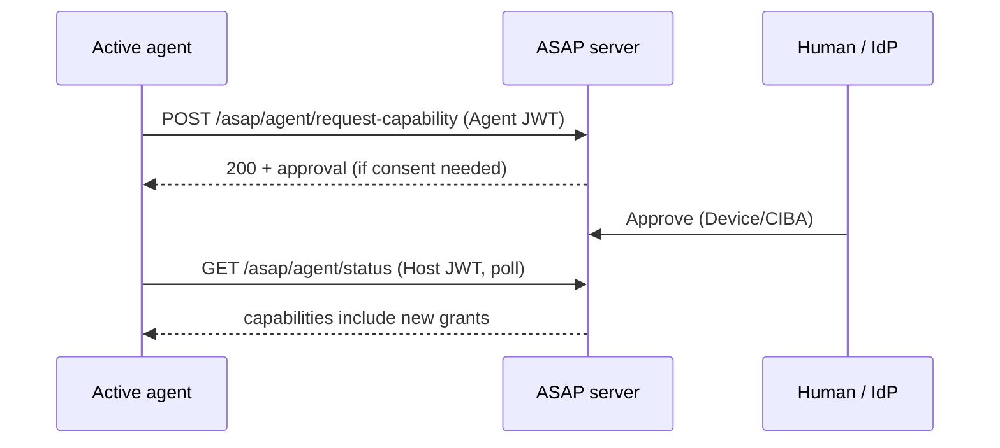

# Capability escalation

Long-running agents sometimes need **additional capabilities** after registration (e.g. a delegated agent that was only granted read access must later write). Escalation reuses the same host policy and approval channels (Device Authorization or CIBA) as registration.

## Flow

1. The active agent calls `POST /asap/agent/request-capability` with an **Agent JWT** and body `{ "capabilities": [{ "name": "...", "constraints": { ... }? }] }`.
2. For each requested capability, the server compares the name to the host’s `default_capabilities`:
   - **Inside defaults** → grant is applied immediately (`active` in the registry).
   - **Outside defaults** → an `ApprovalObject` is created (`pending`) using the configured approval method.
3. The human approves (or denies) via the same UX as registration.
4. The operator (or automation) polls `GET /asap/agent/status` with a **Host JWT**; when the escalation approval is `approved`, the server applies the new grants and clears the escalation approval record. The agent session remains **active** throughout.



## Python

Use `ASAPClient.request_capability` with both **Agent JWT** (POST) and **Host JWT** (status polling) materialized as bearer strings from your host/agent key material:

```python
receipt = await client.request_capability(
    agent_id,
    [{"name": "admin:config"}],
    agent_bearer_token=agent_jwt,
    host_bearer_token_for_status=host_jwt,
)
```

Domain helper: `partition_escalation_capability_specs()` in `asap.auth.capabilities` splits specs into **needs user consent** vs **auto-grant** buckets (same policy as the server).

## TypeScript

`requestCapability(provider, agent, capabilities, { audience, fetch })` in `packages/typescript/client` mirrors the POST semantics (Agent JWT via `agent.signAgentJwt`). Clients that need polling should call `agentStatus` until `approvalStatus` is no longer `pending`.

## See also

- [WWW-Authenticate ASAP challenge](../transport/asap-challenge.md) when a capability call fails authorization.
- [Transport guide](../transport.md)
