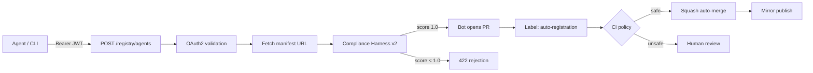

# Lite Registry auto-registration

Self-service registration targets the static **Lite Registry** (`registry.json` in this repository) using a **bot-authored pull request** flow: your agent is validated, a PR is opened, and CI may enable **squash auto-merge** when the change is safe (self-signed path only). There is no PostgreSQL backend; the public mirror (for example GitHub Pages) updates after merge.

See also: [Registry verification review (admin)](../guides/registry-verification-review.md) for the separate **Verified** badge path.

## End-to-end flow



1. Client obtains an **OAuth2** access token from your IdP (client credentials or the flow your deployment supports).
2. Client calls **`POST /registry/agents`** on the **registry-bot** deployment (or a future wired route on your ASAP server) with `Authorization: Bearer <token>` and a JSON body (see below).
3. The service validates the token, fetches the manifest, runs **Compliance Harness v2**, and (when implemented) opens a PR that only edits `registry.json`.
4. The PR is labeled **`auto-registration`**. GitHub Actions ([`.github/workflows/auto-merge-registry.yml`](https://github.com/asap-protocol/asap-protocol/blob/main/.github/workflows/auto-merge-registry.yml)) runs:
   - **Changed files**: only `registry.json` may differ from the base branch.
   - **Schema**: `scripts/validate_registry.py` must accept the head `registry.json`.
   - **Self-signed path**: no new agent may ship with `verification.status: "verified"`, and no existing agent may be **promoted** to `verified` in the same PR (those changes require the manual verification process).
5. If all checks pass and the PR is from the **same repository** (not a fork), the workflow enables **squash auto-merge**. Otherwise maintainers review and merge manually.

Manifest **trust level** (`signature.trust_level` on the signed manifest: `self-signed` vs `verified`) is enforced at registration time by the handler; the **registry** uses the `verification` object for the marketplace badge. Auto-merge policy maps “self-signed registration” to **no verified badge** in `registry.json` on that PR.

## OAuth2 token

The registry-bot validates **Bearer** JWTs the same way as other ASAP HTTP surfaces: configure JWKS (or OIDC discovery) via project conventions, for example:

| Variable | Purpose |
|----------|---------|
| `ASAP_AUTH_JWKS_URI` | JWKS URL for signature validation on `/registry/*` |
| `ASAP_AUTH_ISSUER` | Issuer; used with OIDC discovery when JWKS URI is derived; when set, OAuth2 middleware validates JWT `iss` |
| `ASAP_AUTH_AUDIENCE` | Optional expected JWT `aud` (comma-separated for multiple values); enforced by OAuth2 middleware when set |

Tokens must include the **`asap:registry`** scope (see `REGISTRY_REGISTER_SCOPE` in `asap.registry.auto_registration`).

See [Transport](../transport.md), [Security](../security.md), and the [v1.1 security model](../security/v1.1-security-model.md) for OAuth2 and Custom Claims.

## Request payload

Expected JSON body (contract aligns with Sprint S3 / PRD v2.3):

| Field | Type | Required | Description |
|-------|------|----------|-------------|
| `manifest_url` | string (URL) | Yes | HTTPS URL to the agent’s signed manifest or discovery document |

Example:

```json
{
  "manifest_url": "https://my-agent.example.com/.well-known/asap/manifest.json"
}
```

## Successful response

A successful submission returns a **registration receipt** (Pydantic model `RegistrationReceipt` in `asap.registry.auto_registration`):

| Field | Description |
|-------|-------------|
| `agent_id` | Deterministic id for idempotency |
| `urn` | Agent URN |
| `harness_score` | Compliance Harness v2 score (1.0 when passing) |
| `pr_url` | GitHub PR URL (when the bot PR flow is configured) |
| `status` | `queued`, `merged`, or `verified-pending` |
| `trust_level` | `self-signed` for auto-registered listings |

## Common rejections

| Condition | Typical HTTP | Notes |
|-----------|--------------|--------|
| Missing or invalid Bearer token | 401 | Check JWKS, expiry, issuer/audience |
| Manifest URL unreachable or invalid | 422 / 502 | SSRF protections apply per transport policy |
| Compliance Harness v2 **score < 1.0** | 422 | Response includes score and failed checks |
| **Rate limit** (per token, e.g. 5/hour when enabled) | 429 | Retry after window |
| Idempotent replay | 200 | Same `manifest_url` may return the same receipt |

## Upgrading to **Verified**

Auto-registration lands agents on the **self-signed** path: `registry.json` entries must not use `verification.status: "verified"` on the auto-merge PR.

To obtain the **Verified** marketplace badge:

1. Ensure the agent is already listed in `registry.json`.
2. Open a **[Request Verification](https://github.com/asap-protocol/asap-protocol/blob/main/.github/ISSUE_TEMPLATE/request_verification.yml)** issue and follow [Registry verification review (admin)](../guides/registry-verification-review.md).
3. After maintainer approval, a human updates `registry.json` with `verification.status: "verified"` (and `verified_at` as appropriate).

That path **disables** squash auto-merge for the `auto-registration` policy on the same PR if someone attempts to sneak a verified promotion.

## Related automation

- **IssueOps registration** (manual issue form): [`.github/workflows/register-agent.yml`](https://github.com/asap-protocol/asap-protocol/blob/main/.github/workflows/register-agent.yml)
- **Registry JSON schema** (Python): `asap.discovery.registry.LiteRegistry` / `RegistryEntry`
- **Deployable service**: [`apps/registry-bot/README.md`](https://github.com/asap-protocol/asap-protocol/blob/main/apps/registry-bot/README.md)
