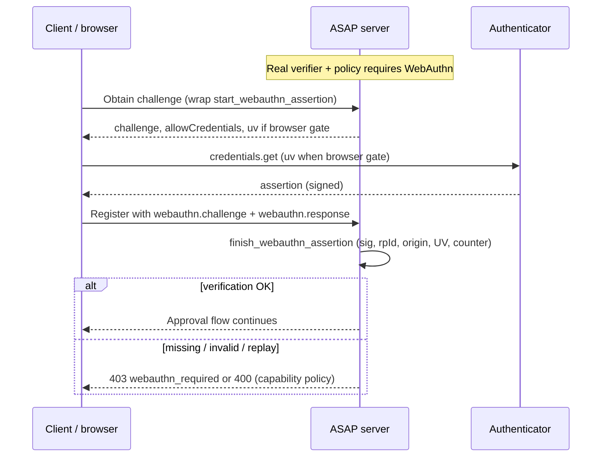

# Self-authorization prevention

This document describes the threat of **self-authorization** in ASAP approval
flows (PRD §4.5), mitigations shipped in the reference implementation, and how
operators should configure them.

## Threat

An **agent that controls the browser** (or an automation layer around it) can
drive the user through Device Authorization on the **same** machine: open
`verification_uri`, paste or infer `user_code`, and complete consent without a
human making a deliberate, separate-device decision. That effectively lets the
agent approve its own registration or escalation.

Related risks:

- Long-lived or reused Host JWTs can be replayed to start approval while the
  human is not present.
- High-risk capabilities approved without **proof-of-presence** can be abused
  if only a password or passive session is available.

## Mitigations (protocol and product)

| ID | Mitigation |
| --- | --- |
| SELF-001 | Fresh authentication on approval paths |
| SELF-002 | WebAuthn / hardware-backed proof |
| SELF-003 | CIBA preference when the agent controls the browser |
| SELF-005 | Configuration surface |

**SELF-001.** Host JWT `iat` must fall within
`FreshSessionConfig.window_seconds` when `identity_fresh_session_config` is
set on the app. Applies to registration that requires approval and to
`GET /asap/agent/status` polling while approval is **pending**.

**SELF-002.** `FreshSessionConfig.require_webauthn_for` lists capability names
that require a `webauthn` object in the register JSON body. Verifier is
pluggable (`identity_webauthn_verifier`). With
`pip install 'asap-protocol[webauthn]'` and `ASAP_WEBAUTHN_RP_ID` plus
`ASAP_WEBAUTHN_ORIGIN`, the default verifier performs real ceremonies
(`WebAuthnVerifierImpl`); otherwise `PlaceholderWebAuthnVerifier` keeps prior
behavior. For browser-embedded agents with a real verifier, the server requires
**user verification** on assertions (see [Real WebAuthn](#real-webauthn)).

**SELF-003.** Clients MAY send `"agent_controls_browser": true` on register.
When the host is linked (`user_id`) and CIBA is supported, the server selects
**CIBA** so approval can be completed on another channel/device, even if the
client hinted `device_authorization`.

**SELF-005.** `FreshSessionConfig.window_seconds` defaults to **300** seconds
(`freshSessionWindow`).

## Real WebAuthn

This section ties the abstract **SELF-002** mitigation to the reference
implementation: cryptographic verification with the optional
[`webauthn`](https://github.com/duo-labs/py_webauthn) dependency, credential
storage scoped by `host_id`, and strict behavior when the agent admits it
controls the browser.

### Threat model (concrete verification)

Without real WebAuthn, a malicious or compromised client could send a crafted
JSON `webauthn` block and the placeholder verifier would still accept it—**no
proof-of-possession** of a private key bound to the host.

With **real verification** enabled, the server:

1. **Registration** (`WebAuthnVerifierImpl.finish_webauthn_registration`):
   validates the attestation/response against the pending random challenge,
   `rpId`, and `origin` using `verify_registration_response`, then persists
   `credential_id`, COSE **public key**, and initial **sign count** in a
   `WebAuthnCredentialStore` keyed by `host_id`.
2. **Assertion** (`WebAuthnVerifierImpl.finish_webauthn_assertion`): requires
   the client-supplied `webauthn.challenge` (base64url) to match the server’s
   pending challenge for that `host_id`, loads the stored public key, and runs
   `verify_authentication_response`. **Replay** and **cloned authenticator**
   attempts are rejected when the authenticator’s sign counter does not
   strictly increase after a successful verification.
3. **User verification (UV)**: when `agent_controls_browser` is true and the
   app uses a real verifier (`WebAuthnSelfAuthVerifier`),
   `check_webauthn_for_approval_path` calls `verify` with
   `require_user_verification=True`, so assertions without UV in authenticator
   data fail. Authentication options are generated with `user_verification`
   **required** in that mode so relying parties and authenticators align on
   high-assurance behavior.

Residual risks operators should still plan for: **RP ID / origin
misconfiguration** (wrong env values weaken binding), **in-memory default
store** in `default_webauthn_verifier()` (credentials lost on restart unless a
custom store and verifier are wired), and **challenge delivery** (the client
must obtain the server-issued challenge before calling
`navigator.credentials.get`; integrators typically expose a small HTTP or RPC
step that wraps `start_webauthn_assertion`).

### Flow (assertion on approval)

High-level sequence for proving presence during agent registration when
WebAuthn is required:



Registration (first-time passkey binding) follows the same pattern: server
issues a registration challenge, client runs `credentials.create`, server runs
`finish_webauthn_registration` and persists the credential for later
assertions.

### Configuration example

Enable the extra and set RP parameters so `default_webauthn_verifier()`
returns `WebAuthnSelfAuthVerifier` wrapping `WebAuthnVerifierImpl`:

```bash
# Optional extra: installs py_webauthn
pip install 'asap-protocol[webauthn]'

# RP: match browser host (no scheme on rp_id)
export ASAP_WEBAUTHN_RP_ID="example.com"
export ASAP_WEBAUTHN_ORIGIN="https://app.example.com"
```

In application code, keep fresh-session and capability policy aligned with
production:

```python
from asap.auth.self_auth import FreshSessionConfig
from asap.transport.server import create_app

app = create_app(
    manifest,
    identity_fresh_session_config=FreshSessionConfig(
        window_seconds=300,
        require_webauthn_for=["sensitive_capability_name"],
    ),
)
```

Pass a custom `identity_webauthn_verifier` when you need a **durable**
`WebAuthnCredentialStore` (for example `SQLiteWebAuthnCredentialStore`) or
non-default `rp_name`.

### Fallback when the extra is not installed (or env is incomplete)

`default_webauthn_verifier()` returns `PlaceholderWebAuthnVerifier` when:

- the `webauthn` distribution package is **not** installed, or
- **`ASAP_WEBAUTHN_RP_ID`** or **`ASAP_WEBAUTHN_ORIGIN`** is missing or empty.

In that mode, **SELF-002 is not cryptographically enforced**; behavior matches
pre–v2.2.1 deployments. The **browser-controlled agent + real verifier** gate
(`403` / `webauthn_required`) applies only when `uses_real_webauthn_verifier`
is true, so missing configuration does not block registration with a stub
verifier—it is an explicit **compatibility default**, not a silent security
upgrade.

## Configuration guidance

1. **Enable fresh sessions in production** for any deployment that exposes
   approval:

   ```python
   from asap.auth.self_auth import FreshSessionConfig
   from asap.transport.server import create_app

   app = create_app(
       manifest,
       identity_fresh_session_config=FreshSessionConfig(window_seconds=300),
   )
   ```

2. **Tighten the window** for high-assurance environments (e.g. 120 seconds)
   so stale Host JWTs cannot open new approval sessions.

3. **List sensitive capabilities** under `require_webauthn_for` and supply a
   real `WebAuthnVerifier` implementation. Treat the placeholder verifier as
   **test-only**.

4. **Prefer CIBA** for browser-embedded agents: set host `user_id`, ensure
   `identity_host_supports_ciba=True`, and have clients set
   `agent_controls_browser: true` when accurate.

5. **Operational**: combine with human review, audit of approvals, and
   least-privilege default capabilities (see capability defaults on
   `HostIdentity`).

## References

- PRD: `prd-v2.2-protocol-hardening.md` §4.5 (Self-Authorization Prevention)
- Code: `src/asap/auth/self_auth.py`, approval-aware routes in
  `src/asap/transport/agent_routes.py`
