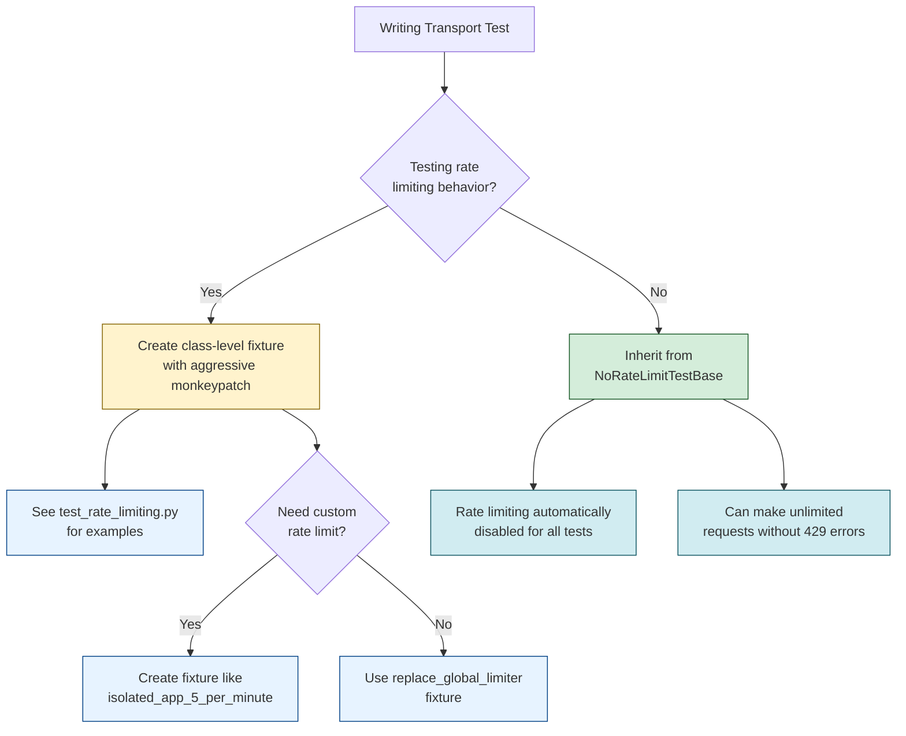

# Testing Guide

This guide covers the testing infrastructure for the ASAP Protocol implementation.

## Running Tests

**Always use `uv run pytest` to run tests:**

```bash
# Run all tests
uv run pytest

# Run specific test file
uv run pytest tests/transport/integration/test_rate_limiting.py -v

# Run specific test
uv run pytest tests/transport/integration/test_rate_limiting.py::TestRateLimiting::test_requests_within_limit_succeed -v

# Run with coverage
uv run pytest --cov=src --cov-report=html

# Run in parallel (using pytest-xdist)
uv run pytest -n auto
```

**Why `uv run pytest` instead of `pytest`?**

The project requires Python 3.13+, but your system may have a global `pytest` installed under an older Python version (e.g., Python 3.9). Using `uv run pytest` ensures:

1. ✅ Correct Python version (from `.venv`, not system Python)
2. ✅ Correct pytest version (from project dependencies)
3. ✅ All project dependencies are available
4. ✅ Consistent with CI environment

**Alternative:** Activate the virtual environment first:

```bash
source .venv/bin/activate
pytest tests/transport/integration/test_rate_limiting.py -v
deactivate
```

---

## Test Organization

Tests are organized into three categories based on their scope and dependencies:

### Unit Tests (`tests/transport/unit/`)

Unit tests validate isolated components without external dependencies. These tests:
- Test individual classes or functions in isolation
- Have no HTTP dependencies
- Have no rate limiting dependencies
- Run very fast
- Are deterministic and repeatable

**Example**: `test_bounded_executor.py` tests the `BoundedExecutor` class without any HTTP or rate limiting.

### Integration Tests (`tests/transport/integration/`)

Integration tests validate component interactions within the transport layer. These tests:
- Test interactions between multiple components (e.g., server, middleware, handlers)
- May use HTTP clients (`TestClient`)
- Are organized by feature area:
  - `test_rate_limiting.py` - Rate limiting functionality (isolated file)
  - `test_request_size_limits.py` - Request size validation
  - `test_thread_pool_bounds.py` - Thread pool exhaustion handling
  - `test_metrics_cardinality.py` - Metrics cardinality protection
  - `test_server_core.py` - Core server functionality (endpoints, handlers, metrics)

**IMPORTANT**: Integration tests use fixtures from `tests/transport/conftest.py`. See the [Fixtures](#pytest-fixtures-explained) section for details.

### E2E Tests (`tests/transport/e2e/`)

End-to-end tests validate the full agent flow using real agent implementations. These tests:
- Test complete workflows from request to response
- Use the full stack (server, handlers, state management)
- Validate cross-component behavior
- Are slower but provide high confidence

**Example**: `test_full_agent_flow.py` tests complete round-trip agent interactions.

## Test Isolation Strategy

The ASAP Protocol test suite uses a **three-pronged approach** to ensure complete test isolation and prevent interference, especially from rate limiting:

### 1. Process Isolation (pytest-xdist)

We use `pytest-xdist` to run tests in separate processes, providing complete isolation at the process level. This is the primary mechanism for preventing interference.

**Usage**:
```bash
# Run tests in parallel with automatic worker count
uv run pytest -n auto

# Run with specific number of workers
uv run pytest -n 4
```

**Benefits**:
- Complete process-level isolation
- No shared state between test processes
- Faster execution on multi-core systems
- Automatic worker count based on CPU cores

### 2. Aggressive Monkeypatch Fixtures

For tests that can't benefit from process isolation (or need additional isolation), we use "aggressive monkeypatch" fixtures that replace module-level rate limiters.

**Why "Aggressive Monkeypatch"?**

The `slowapi.Limiter` library maintains global state that persists across tests, even with unique storage URIs. Simply replacing `app.state.limiter` is not sufficient because:

- The limiter is created at module import time
- Code may reference the module-level limiter directly
- Internal state persists even with different storage URIs

**Solution**: Our fixtures replace the limiter at the **module level** in both `asap.transport.middleware` and `asap.transport.server`, ensuring complete isolation even when code uses the global limiter directly.

**Example**:
```python
def test_rate_limiting(replace_global_limiter, isolated_limiter_factory):
    # replace_global_limiter automatically replaces module-level limiters
    limiter = isolated_limiter_factory(["5/minute"])
    # Global limiter is now replaced, app will use it automatically
    app = create_app(manifest, rate_limit="5/minute")
```

### 3. Strategic Test Organization

Tests are strategically organized to prevent interference:

- **Rate limiting tests** are in a separate file (`test_rate_limiting.py`) that runs in isolated processes
- **Non-rate-limiting tests** inherit from `NoRateLimitTestBase` to automatically disable rate limiting
- **Unit tests** have no rate limiting dependencies at all

This organization ensures that rate limiting tests don't interfere with other tests, and vice versa.

## Rate Limiting in Tests

### NoRateLimitTestBase

For tests that don't need rate limiting, inherit from `NoRateLimitTestBase`:

```python
from tests.transport.conftest import NoRateLimitTestBase

class TestMyFeature(NoRateLimitTestBase):
    """Tests for my feature without rate limiting interference."""

    def test_something(self, manifest):
        # Rate limiting is automatically disabled
        app = create_app(manifest)
        # Test your feature without rate limiting concerns
```

**What it does**:
- Automatically disables rate limiting for all tests in the class
- Replaces module-level limiters with a no-limit limiter
- Prevents interference from rate limiting tests
- No need to manually configure rate limiting

**When to use**:
- Tests that don't test rate limiting functionality
- Tests that need to make many requests without hitting limits
- Integration tests that test other features (size validation, thread pools, etc.)

### Testing Rate Limiting

When writing tests specifically for rate limiting functionality:

1. **Use aggressive monkeypatch**: Use `replace_global_limiter` or manually replace module-level limiters
2. **Isolate in separate file**: Put rate limiting tests in `test_rate_limiting.py`
3. **Use isolated limiters**: Use `isolated_limiter_factory` to create fresh limiters

**Example**:
```python
def test_rate_limit_exceeded(
    monkeypatch,
    isolated_limiter_factory,
    rate_limit_manifest,
):
    # Create isolated limiter with specific limits
    limiter = isolated_limiter_factory(["2/minute"])

    # Replace global limiter in both modules
    import asap.transport.middleware as middleware_module
    import asap.transport.server as server_module

    monkeypatch.setattr(middleware_module, "limiter", limiter)
    monkeypatch.setattr(server_module, "limiter", limiter)

    # Create app with rate limiting
    app = create_app(rate_limit_manifest, rate_limit="2/minute")
    app.state.limiter = limiter

    client = TestClient(app)

    # Make requests and verify rate limiting behavior
    # ...
```

## Choosing the Right Test Isolation Strategy

When writing transport layer tests, use this decision tree to choose the appropriate fixtures and test organization:



### Quick Reference Table

| Your Test Needs | Recommended Approach | Example |
|----------------|---------------------|---------|
| **Testing rate limiting** | Class-level fixture with aggressive monkeypatch | `test_rate_limiting.py` |
| **NOT testing rate limiting** | Inherit from `NoRateLimitTestBase` | Most integration tests |
| **Unit test (no HTTP)** | No special fixtures needed | `test_bounded_executor.py` |
| **Custom rate limit (e.g., 5/min)** | Create class-level fixture | See `isolated_app_5_per_minute` |
| **Testing other features** | `NoRateLimitTestBase` + specific fixtures | `test_request_size_limits.py` |

### When to Use Each Fixture

#### Use `NoRateLimitTestBase` when:
- ✅ Testing features OTHER than rate limiting
- ✅ Need to make many requests without hitting limits
- ✅ Testing thread pools, request size limits, metrics, etc.
- ✅ Running integration tests that involve HTTP but not rate limiting

#### Use Aggressive Monkeypatch Fixtures when:
- ✅ **Explicitly testing rate limiting behavior**
- ✅ Need precise control over rate limit values
- ✅ Testing limit thresholds, resets, or error responses
- ✅ Creating rate limiting tests in `test_rate_limiting.py`

#### Use Neither (plain pytest) when:
- ✅ Unit tests with no HTTP dependencies
- ✅ Testing pure functions or classes
- ✅ No rate limiting or app creation involved

### Example: Creating a Class-Level Fixture for Rate Limiting Tests

```python
class TestMyRateLimitFeature:
    """Tests for rate limiting with custom limits."""
    
    @pytest.fixture
    def isolated_app_custom_limit(
        self,
        monkeypatch: pytest.MonkeyPatch,
        isolated_limiter_factory: Callable,
        manifest: Manifest,
    ) -> FastAPI:
        """Create app with custom rate limit."""
        # Create isolated limiter
        limiter = isolated_limiter_factory(["10/minute"])
        
        # Aggressive monkeypatch - replace in BOTH modules
        import asap.transport.middleware as middleware_module
        import asap.transport.server as server_module
        
        monkeypatch.setattr(middleware_module, "limiter", limiter)
        monkeypatch.setattr(server_module, "limiter", limiter)
        
        # Create app
        app = create_app(manifest, rate_limit="10/minute")
        app.state.limiter = limiter
        
        return app
    
    def test_my_rate_limit_feature(
        self,
        isolated_app_custom_limit: FastAPI,
    ) -> None:
        """Test uses the custom rate-limited app."""
        client = TestClient(isolated_app_custom_limit)
        # Test implementation...
```

---

## Pytest Fixtures Explained

### What are Fixtures?

Fixtures are pytest's way of providing test dependencies. They:
- Set up test data or objects
- Provide reusable test components
- Ensure proper cleanup after tests
- Can be shared across multiple tests

### Factory Fixtures vs Regular Fixtures

**Regular Fixtures**: Return a single value that is reused (or recreated) for each test:
```python
@pytest.fixture
def manifest() -> Manifest:
    """Returns a single Manifest instance."""
    return Manifest(...)
```

**Factory Fixtures**: Return a function that creates new instances:
```python
@pytest.fixture
def isolated_limiter_factory():
    """Returns a function that creates new limiters."""
    def _create(limits=None):
        return Limiter(...)
    return _create
```

Factory fixtures are useful when you need multiple instances with different configurations.

### Our Specific Fixtures

#### `isolated_limiter_factory`

A factory fixture that creates isolated rate limiters with unique storage:

```python
def test_something(isolated_limiter_factory):
    # Create a limiter with specific limits
    limiter = isolated_limiter_factory(["10/minute"])
    
    # Each call creates a NEW limiter with isolated storage
    another_limiter = isolated_limiter_factory(["5/minute"])
```

**Why we created it**: Ensures each test gets a completely fresh limiter with no shared state.

#### `replace_global_limiter`

A fixture that replaces module-level limiters using aggressive monkeypatch:

```python
def test_something(replace_global_limiter):
    # Global limiter is automatically replaced
    # Any code using the module-level limiter will use the new one
    app = create_app(manifest)
```

**Why we created it**: Provides complete isolation by replacing limiters at the module level, not just at the app level.

#### `create_isolated_app`

A factory fixture that creates apps with isolated limiters:

```python
def test_something(create_isolated_app, manifest):
    # Create app with isolated limiter
    app = create_isolated_app(
        manifest,
        rate_limit="10/minute",
        use_monkeypatch=True,  # Use aggressive monkeypatch
    )
```

**Why we created it**: Simplifies app creation for tests that need complete isolation.

### How Fixtures Provide Test Isolation

Fixtures ensure test isolation by:
1. **Creating fresh instances**: Each test gets its own instances of fixtures
2. **Using unique identifiers**: UUIDs and unique storage URIs prevent state sharing
3. **Replacing global state**: Monkeypatch fixtures replace module-level state
4. **Automatic cleanup**: Pytest automatically cleans up fixtures after tests

## Running Tests

### Basic Commands

Run all tests:
```bash
uv run pytest
```

Run with coverage:
```bash
uv run pytest --cov=src --cov-report=term-missing
```

Run specific test file:
```bash
uv run pytest tests/transport/unit/test_bounded_executor.py
```

Run specific test class:
```bash
uv run pytest tests/transport/integration/test_rate_limiting.py::TestRateLimiting
```

Run specific test method:
```bash
uv run pytest tests/transport/unit/test_bounded_executor.py::TestBoundedExecutor::test_submit_task
```

### Parallel Execution

Run tests in parallel with pytest-xdist:
```bash
# Automatic worker count (recommended)
uv run pytest -n auto

# Specific number of workers
uv run pytest -n 4

# With coverage (coverage is aggregated automatically)
uv run pytest -n auto --cov=src --cov-report=term-missing
```

**Benefits**:
- Faster execution on multi-core systems
- Complete process-level isolation
- Automatic worker count based on CPU cores

### Running by Test Type

Run only unit tests:
```bash
uv run pytest tests/transport/unit/
```

Run only integration tests:
```bash
uv run pytest tests/transport/integration/
```

Run only E2E tests:
```bash
uv run pytest tests/transport/e2e/
```

### Verbose Output

For more detailed output:
```bash
# Verbose mode
uv run pytest -v

# Very verbose (shows each test name)
uv run pytest -vv

# Show print statements
uv run pytest -s
```

## Writing New Tests

### Choosing the Right Directory

1. **Unit tests** (`tests/transport/unit/`):
   - Test individual classes/functions
   - No HTTP dependencies
   - No rate limiting dependencies
   - Fast and deterministic

2. **Integration tests** (`tests/transport/integration/`):
   - Test component interactions
   - May use HTTP clients
   - Use `NoRateLimitTestBase` if not testing rate limiting
   - Use aggressive monkeypatch if testing rate limiting

3. **E2E tests** (`tests/transport/e2e/`):
   - Test complete workflows
   - Use full stack
   - Inherit from `NoRateLimitTestBase`

### Choosing the Right Base Class

**For non-rate-limiting tests**:
```python
from tests.transport.conftest import NoRateLimitTestBase

class TestMyFeature(NoRateLimitTestBase):
    """Tests automatically have rate limiting disabled."""
    pass
```

**For rate limiting tests**:
```python
# Don't inherit from NoRateLimitTestBase
# Use aggressive monkeypatch instead
def test_rate_limiting(monkeypatch, isolated_limiter_factory):
    # Manual limiter replacement
    pass
```

### Test Structure

Follow this structure for new tests:

```python
"""Brief description of what this test module covers."""

import pytest
from fastapi.testclient import TestClient

from tests.transport.conftest import NoRateLimitTestBase


class TestMyFeature(NoRateLimitTestBase):
    """Tests for my feature."""

    @pytest.fixture
    def manifest(self) -> Manifest:
        """Create test manifest."""
        return Manifest(...)

    def test_specific_behavior(self, manifest: Manifest) -> None:
        """Test a specific behavior."""
        # Arrange
        app = create_app(manifest)
        client = TestClient(app)

        # Act
        response = client.post("/asap", json={...})

        # Assert
        assert response.status_code == 200
        assert response.json()["result"] == expected_value
```

### Best Practices

1. **Use type hints**: All test functions should have type annotations
2. **Descriptive names**: Test names should clearly describe what they test
3. **One assertion per concept**: Group related assertions, but test one concept per test
4. **Use fixtures**: Don't duplicate setup code, use fixtures
5. **Isolation**: Each test should be independent and runnable in isolation
6. **Fast tests**: Keep tests fast (< 1 second when possible)
7. **Deterministic**: Tests should produce the same results every time

## Troubleshooting

### Tests Failing with HTTP 429 (Rate Limit Exceeded)

**Symptom**: Tests fail with "429 Too Many Requests" even when not testing rate limiting.

**Solution**:
1. Inherit from `NoRateLimitTestBase`:
   ```python
   class TestMyFeature(NoRateLimitTestBase):
       pass
   ```

2. Or use `replace_global_limiter` fixture:
   ```python
   def test_something(replace_global_limiter):
       # Rate limiting is now isolated
       pass
   ```

### Tests Interfering with Each Other

**Symptom**: Tests pass individually but fail when run together.

**Solution**:
1. Ensure tests use isolated fixtures (`isolated_limiter_factory`, `replace_global_limiter`)
2. Run with pytest-xdist for process isolation: `pytest -n auto`
3. Check that rate limiting tests are in `test_rate_limiting.py`
4. Verify non-rate-limiting tests inherit from `NoRateLimitTestBase`

### Slow Test Execution

**Solution**:
1. Use parallel execution: `pytest -n auto`
2. Run only relevant tests during development
3. Use `pytest --lf` to run only failed tests from last run
4. Use `pytest --ff` to run failed tests first, then others

## CI Integration

Tests run automatically in CI with:
- Parallel execution (`-n auto`)
- Coverage reporting
- All checks (linting, formatting, type checking, security)

See `.github/workflows/ci.yml` for the complete CI configuration.
